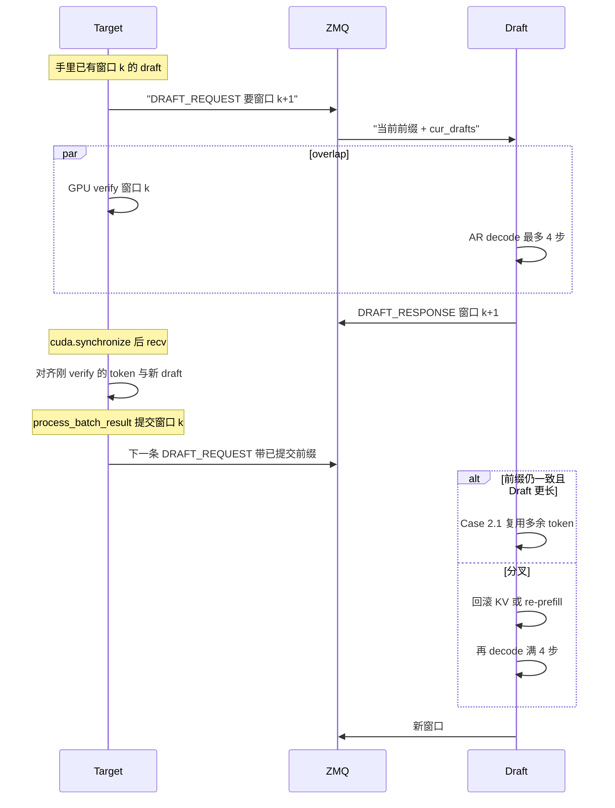

# SPECTRE 支持说明

本文说明本树里 [SPECTRE](python/sglang/srt/speculative/spectre) 投机解码支持什么、怎么编译、怎么启动，以及 VL 路径的约束。官方总览仍见 [README.md](README.md)。

SPECTRE 使用**两个独立的 SGLang 进程**：Target 做 verify，Draft 产 draft token。进程间用 C++ ZMQ 传控制和 token；视觉 tensor 不走这条通道。

两端都必须带：

```text
--speculative-algorithm SPECTRE --spectre-role {target|draft}
```

`--speculative-algorithm SPECTRE` 在 Draft 上用来关闭 overlap、跑 VL 校验；Draft **不会**包 `SpectreWorker`，prefill/decode 走普通 `TpModelWorker`。`SpectreWorker` 只给 Target 做 verify。HTTP 只打 Target。两边都建议 `--skip-server-warmup`：Target warmup 会自己发一条 generate；Draft warmup 会掺进 draft 调度。先等两端都起来，再 curl Target。

先正确性（短请求、greedy 对齐），再开 CUDA Graph、混合流量、跨机 TCP 和 `TP>1`。

## 支持矩阵

| 能力 | 状态 |
| --- | --- |
| 文本投机 | 支持。与模型是否 VL 无关。 |
| Qwen3-VL 图 / 视频 | 支持。架构 `Qwen3VLForConditionalGeneration`。 |
| Qwen3-VL-MoE 图 / 视频 | 支持。架构 `Qwen3VLMoeForConditionalGeneration`。 |
| 任意其他 VLM | **不宣称开箱即用。** 需要模型提供 `get_image_feature` / `get_video_feature` 以及 M-RoPE processor。 |
| 音频 | payload 里有字段，**预热路径未接**。 |

VL 走 **Route A：Draft 自跑 ViT**。Target 的 processor 已经把 vision 占位符 pad 进 `input_ids`；Draft **复用** 这份序列和 `pad_value`，**不再**调用 `pad_input_ids`。再 pad 一次会对不齐 embedding，接受率会 silently 崩。

纯文本的 Qwen3-VL 请求不发 mm 旁路，按普通 SPECTRE 投机。

## 安装与编译

SPECTRE 不是纯 Python。除了按官方方式 editable 安装 SGLang，还必须编译 C++17 / pybind11 / ZeroMQ / msgpack 扩展，产出 `spectre_zmq*.so` 并链接 `libzmq`。编译期需要 `/usr/include/zmq.hpp`（cppzmq）。跨机时 **两台都要编**。

```bash
python3 -m venv .venv
source .venv/bin/activate
python -m pip install --upgrade pip setuptools wheel
python -m pip install -e "python"
```

仓库根目录不是 Python 包；包在 [`python/`](python/)（含 `pyproject.toml`），所以路径是 `"python"`。`-e` 为 editable：改 `python/sglang/` 下源码立刻生效，不必重装。这一步只装 SGLang 及 pip 依赖，**不会**编 `spectre_zmq*.so`；C++ 扩展仍按后文手动 `setup.py build_ext --inplace`。

不要在 venv 里直接跑 [`python/sglang/srt/speculative/spectre/cpp_zmq/scripts/build_cpp_zmq.sh`](python/sglang/srt/speculative/spectre/cpp_zmq/scripts/build_cpp_zmq.sh)：它会 `pip install ... --break-system-packages` 并 `apt-get install`。Ubuntu/Debian 建议手动装依赖后原地编译：

```bash
sudo apt-get update
sudo apt-get install -y \
    build-essential \
    libzmq3-dev \
    cppzmq-dev \
    libmsgpack-dev

python -m pip install pybind11 msgpack

# cppzmq-dev 不一定装到这个路径；缺失则把 zmq.hpp 放到此处
ls /usr/include/zmq.hpp

cd python/sglang/srt/speculative/spectre/cpp_zmq
python setup.py build_ext --inplace
cd ../../../../../..
```

验证导入：

```bash
python - <<'PY'
from sglang.srt.speculative.spectre.cpp_zmq import (
    DealerEndpoint,
    RouterEndpoint,
    set_spectre_log_level,
)
print("spectre_zmq import OK")
PY
```

失败时检查扩展是否生成、以及动态库依赖：

```bash
find python/sglang/srt/speculative/spectre/cpp_zmq \
  -name 'spectre_zmq*.so' -ls
ldd python/sglang/srt/speculative/spectre/cpp_zmq/spectre_zmq*.so
```

[`cpp_zmq/__init__.py`](python/sglang/srt/speculative/spectre/cpp_zmq/__init__.py) 在导入失败时会尝试自动调用构建脚本，但错误往往被吞掉。本地调试应手动编译，才能看到完整编译输出。

## 最小用法

协议直接传 token ID，不做跨 tokenizer 映射。Draft 与 Target 必须使用 **相同 tokenizer 和 vocabulary**。

`--spectre-zmq-addr` 为 `127.0.0.1` 或 `0.0.0.0` 时走 IPC（`ipc:///tmp/{sanitized_addr}_{port}`）；否则走 TCP。默认 `--spectre-zmq-port` 是 `30009`。两端 address / port 必须一致。Target 使用 Router（bind），Draft 使用 Dealer（connect）。

**先起 Target，等就绪，再起 Draft。** HTTP 只打 Target 端口，不要打 Draft。

第一次建议：单机、双 GPU、`tp=1`、`topk=1`、`--page-size 1`、`--disable-cuda-graph`。不要一上来跨机 TCP、`TP>1` 或 CUDA Graph。日志用 `--log-level debug`。

### 投机窗口

下面三个参数决定「Draft 猜多宽、Target 一次核多宽」。示例值 `3 / 1 / 4` 与后文启动命令一致。

```text
前缀 |  位置1    位置2    位置3    位置4
     |  Draft    Draft    Draft    Target bonus
     |  <── num-steps=3, topk=1 一条链 ──>
     |  <────── num-draft-tokens=4 ──────>
```

| 参数 | 含义 |
| --- | --- |
| `--speculative-num-steps` | Draft 沿一条链连续猜多少个 token。SPECTRE Target **向 Draft 要 token** 时用 `num_steps + 1`。 |
| `--speculative-eagle-topk` | 每步保留几个候选。`1` 为链（无分叉）；`>1` 为树。当前建议 `1`。 |
| `--speculative-num-draft-tokens` | Target **一次 verify** 核对的位置数。没 draft 时会退化成 `1`（普通 AR）。 |

`topk=1` 时保持 **`num-draft-tokens = num-steps + 1`**（3 个 draft + 1 个 Target 自己采的 bonus）。只改其中一个，Draft 给的长度和 Target 窗口会对不齐。

HTTP `meta_info` 里：`alen` 上限约等于 `num-draft-tokens`；`accept` 的分母是每次 `num-draft-tokens - 1` 个 draft 猜测（bonus 不算猜中）。

### 时序：先发后验、一窗即停、回滚后再开一窗

两端是独立进程。Target **先** ZMQ 要下一窗 draft，**再**对本窗做 GPU verify；Draft 用这段 GPU 时间 AR 往前猜。Draft 产满 **`num_steps + 1`** 个 token（示例为 4，不是 3）就回包并 pause，不会无限 lookahead。

回滚发生在 Draft 收到**下一条**带已提交前缀的 `DRAFT_REQUEST` 时：对齐序列、找分叉点、必要时截断 KV。然后把 `draft_generation_start_len` 重置到对齐后的长度，**再 decode 满一窗（示例 4 步）** 才再次发送并 pause。

下面按启动示例 `num-steps=3 / topk=1 / num-draft-tokens=4`。Target 向 Draft 要的长度是 `num_steps + 1 = 4`。



Token 视角（`A B C D` 是 Target 正在 verify 的窗口 k；`e f g h` 是 Draft 同时在猜的窗口 k+1）：

```text
时间 →
Target : 发 DRAFT_REQUEST |======== GPU verify [A B C D] ========| recv [e f g h]
Draft  : 收请求           |==== e ==== f ==== g ==== h ====| 发送 → pause

下一轮 DRAFT_REQUEST 带着 Target 已提交前缀（例如只接受了 A B，bonus 改写成 X）：

  Draft 原序列 :  ... A  B  C  D  e  f  g  h
  Target 提交  :  ... A  B  X
  fork_point   :          ^  从 C 起丢掉
  回滚后       :  ... A  B  X
  再 decode    :              [ p  q  r  s ]   又是 4 步，然后 pause
```

| 情况 | Draft 做什么 | 回滚后再 decode 几步 |
| --- | --- | --- |
| 前缀完全一致 | 继续或按新 `spec_cnt` 重发已有窗口 | 已满 4 则 **0**（pause 后直接回包）；未满则补齐到 4 |
| Case 2.1（Draft 更长且公共前缀仍对） | 复用超前的 token，不够再补 | `max(0, 4 - 已超前个数)` |
| 分叉且 `page_size=1` | 截断 `output_ids`，local 释放分叉后 KV，从对齐点 resume | **4**（新开一窗） |
| 分叉但 local rollback 不安全（`page_size>1`、分叉落在 prefix cache、Target 超前较多） | 整段 re-prefill 已提交前缀，再 decode | prefill 之后再 **4** |

要点：

- 重叠的是「窗口 k 的 Target verify」和「窗口 k+1 的 Draft decode」，不是同一窗里边验边猜。
- Draft 每窗固定停在 `num_steps + 1`。GPU 还有剩余时间也不会多猜下一窗。
- Target 侧对不上就把 `cur_drafts` 丢掉，下一步可能退化成普通 AR；真正改 Draft KV 要等下一条 `DRAFT_REQUEST`。

### ZMQ 传输内容

C++ 通道是 Target Router（bind）+ Draft Dealer（connect），默认 `--spectre-zmq-port 30009`。统一结构是 `SpectreRequest`（msgpack），只传**控制和 token id**，不做跨 tokenizer 映射。两端必须同一 vocab。不传 KV、Target logits / hidden、权重。有图时这条通道只带关联 id `mm_ref`，视觉 tensor 走 Python PUB/SUB，见 [VL 数据通路](#vl-数据通路)。

文本投机通常只走这条 C++ 通道。

**Target → Draft**

`DRAFT_REQUEST`（要下一窗）：

| 字段 | 何时有 | 含义 |
| --- | --- | --- |
| `request_id` | 总是 | 请求 rid |
| `spec_cnt` | 总是 | 第几轮投机，用来对上响应 |
| `action=draft` / `spec_type=draft_request` | 总是 | 消息类型 |
| `output_ids` | 总是 | Target **已提交**的生成 token |
| `draft_token_ids` | 总是 | `cur_drafts`，让 Draft 接到当前窗口后面继续猜 |
| `num_draft_tokens` | 总是 | 这一窗要几个，正常是 `num_steps + 1` |
| `input_ids` | 仅 `spec_cnt==0` 或熔断 HALF_OPEN | prompt（VL 时已是 pad 过的序列） |
| `sampling_params` | 同上 | temperature / top_p / stop 等 |
| `mm_ref` | 同上且有图 | 旁路 payload 的关联 id（一般等于 rid） |

后续 decode 步不带 `input_ids` / `sampling_params` / `mm_ref`，Draft 用本地 state。`grammar` 目前固定不发。

Verify 对不上时会再发一条 retry：`action=draft`，空的 `draft_token_ids`，带当前 `output_ids` 和 `num_draft_tokens`。

请求结束发 `FINISH` / `ABORT`：`input_ids` / `output_ids` / `draft_token_ids` 都是空，`num_draft_tokens=0`。Draft 据此释放 KV 和 mm。

**Draft → Target**

`DRAFT_RESPONSE`（回一窗）：

| 字段 | 含义 |
| --- | --- |
| `request_id` / `spec_cnt` | 对上那次 `DRAFT_REQUEST` |
| `action=draft` / `spec_type=draft_response` | 消息类型 |
| `draft_token_ids` | 这一窗猜的 token（从 `draft_generation_start_len` 切出） |
| `draft_logprobs` | 对应 logprob（有则带） |

C++ 层还会打 `target_send_time` / `target_recv_time` / `draft_send_time` / `draft_recv_time`，给超时和熔断用。

VL 降级或暂时没有 draft 时回**空窗**（`draft_token_ids=[]`），Target 当步退化成 AR，避免空等 `SPECTRE_RECV_TIMEOUT_MS`。Draft 过载时发 `REJECT`（`request_id="system"`，空 token），Target 会暂时少发或 `draft_num_tokens=1`。

### 文本冒烟（双卡）

可用同一家族的小模型，例如 Draft `Qwen/Qwen3-0.6B`、Target `Qwen/Qwen3-1.7B`。这只覆盖文本 SPECTRE，测不了 Qwen3-VL。非 Hopper 或 FA3 环境不完整时，可用 `--attention-backend triton`。

终端 1 — Target（GPU 1）：

```bash
source .venv/bin/activate
export CUDA_VISIBLE_DEVICES=1
export PYTHONUNBUFFERED=1

python -m sglang.launch_server \
  --model-path Qwen/Qwen3-1.7B \
  --tp 1 \
  --host 127.0.0.1 \
  --port 30000 \
  --speculative-algorithm SPECTRE \
  --spectre-role target \
  --speculative-num-steps 3 \
  --speculative-eagle-topk 1 \
  --speculative-num-draft-tokens 4 \
  --spectre-zmq-addr 127.0.0.1 \
  --spectre-zmq-port 30009 \
  --attention-backend triton \
  --disable-cuda-graph \
  --page-size 1 \
  --skip-server-warmup \
  --log-level debug
```

终端 2 — Draft（GPU 0；等 Target 起来后再启）：

```bash
source .venv/bin/activate
export CUDA_VISIBLE_DEVICES=0
export PYTHONUNBUFFERED=1

python -m sglang.launch_server \
  --model-path Qwen/Qwen3-0.6B \
  --tp 1 \
  --host 127.0.0.1 \
  --port 30008 \
  --speculative-algorithm SPECTRE \
  --spectre-role draft \
  --spectre-zmq-addr 127.0.0.1 \
  --spectre-zmq-port 30009 \
  --disable-cuda-graph \
  --page-size 1 \
  --skip-server-warmup \
  --log-level debug
```

终端 3 — 打 Target：

```bash
curl -s http://127.0.0.1:30000/generate \
  -H 'Content-Type: application/json' \
  -d '{
    "text": "The capital of France is",
    "sampling_params": {
      "temperature": 0,
      "max_new_tokens": 16
    }
  }'
```

`temperature=0` 时，SPECTRE 输出应对齐 **Target 单独 greedy**，不是 Draft。接受率可以低；缺 token、重复、提前结束才是 bug。先做短请求正确性，再考虑吞吐。

IPC 地址占用时，两个进程都停掉后清理（C++ 通道三条 socket，本树 VL 旁路多一条）：

```bash
rm -f /tmp/127_0_0_1_30009 \
      /tmp/127_0_0_1_30009.tx \
      /tmp/127_0_0_1_30009.ctrl \
      /tmp/127_0_0_1_30009_mm
```

若改了 `--spectre-zmq-port`，把文件名里的 `30009` 换成实际端口。

## VL 数据通路

两条通道并行（C++ 控制字段见 [ZMQ 传输内容](#zmq-传输内容)）：

- **Token / 控制**：C++ ZMQ + msgpack。可选尾字段 `mm_ref`（请求 id）。tensor 不进这条通道。
- **视觉 payload**：Python PyZMQ PUB/SUB。同机（`--spectre-zmq-addr` 为 `127.0.0.1` / `0.0.0.0`）走 ipc + POSIX SHM；跨机走 tcp（mm 端口为 `--spectre-zmq-port + 3`）multipart。

Target 仅 rank0 bind PUB；Draft **所有 TP rank** SUB 直收，各自本地跑 ViT。两条通道无顺序保证：`DRAFT_REQUEST` 可能早于 mm payload。

旁路 payload：

| 字段 | 含义 |
| --- | --- |
| `rid` | 与 C++ `mm_ref` 对齐 |
| `padded_input_ids` | Target **已经 pad** 的 prompt。Draft 复用这份序列和 `pad_value`，**不再** `pad_input_ids` |
| `mm_items` | 每张图/视频：pixel 或 feature、`pad_value`、`hash`、offsets、modality |
| special token id | `im_token_id` / `video_token_id` / audio / slice 等，与 Target processor 一致 |

`mm_ref` 只在 full-context 时带上（`spec_cnt==0`，或熔断 HALF_OPEN 重发）。后续 decode 步 mm 已 attach 在 Draft state 上。纯文本请求不发这条旁路。

Draft 事件循环固定顺序：先收 mm → 预热 ViT → 再处理 `DRAFT_REQUEST`。目的是把 ViT 移出 Target 的 `SPECTRE_RECV_TIMEOUT_MS`（默认 5000ms）窗口。

## VL 启动约束

- Draft **不要**加 `--skip-tokenizer-init`。Qwen3-VL 默认 3D M-RoPE；processor 加载失败时 Draft 启动会直接报错，避免静默用纯文本位置编码。
- Draft 建议 `--skip-server-warmup`，避免本机 HTTP warmup 掺进 draft 调度。HTTP 只打 Target。
- Target 也建议 `--skip-server-warmup`。未跳过时启动就会自己发一条 generate；Draft 未就绪时会一直单 token 回退。
- Draft `--context-length` 必须 **≥ Target pad 后的最大 prompt**。vision 占位符会把序列拉得很长。
- Target / Draft 的 `vision_config`（`patch_size`、`spatial_merge_size`、`temporal_patch_size`）和 processor 的 image/video resize 必须一致，否则 ViT 输出行数对不上占位符个数。
- SPECTRE 会关闭 overlap scheduler 和 mixed-chunk prefill。
- 未显式设置时 `--max-running-requests` 会被重置为 48，可用该参数覆盖。

## VL 示例

同机、默认 ipc。把模型路径换成实际 checkpoint。**先起 Target，再起 Draft。** HTTP 打 Target 的 `--port`。

Target：

```bash
python -m sglang.launch_server \
  --model-path /path/to/Qwen3-VL \
  --speculative-algorithm SPECTRE \
  --spectre-role target \
  --spectre-zmq-addr 127.0.0.1 \
  --spectre-zmq-port 30009 \
  --skip-server-warmup \
  --host 0.0.0.0 \
  --port 30000
```

Draft（另开一个进程；**不要** `--skip-tokenizer-init`）：

```bash
python -m sglang.launch_server \
  --model-path /path/to/Qwen3-VL \
  --speculative-algorithm SPECTRE \
  --spectre-role draft \
  --spectre-zmq-addr 127.0.0.1 \
  --spectre-zmq-port 30009 \
  --context-length 32768 \
  --skip-server-warmup \
  --host 0.0.0.0 \
  --port 30001
```

跨机时把 `--spectre-zmq-addr` 换成 Target 可达地址（非 `127.0.0.1` / `0.0.0.0`），传输自动切到 tcp。双方 port 必须一致。

## 环境变量

| 变量 | 默认 | 作用 |
| --- | --- | --- |
| `SPECTRE_RECV_TIMEOUT_MS` | `5000` | Target 等一步 draft 的超时。超时计熔断失败。 |
| `SPECTRE_MM_WAIT_MS` | 上述值的一半 | Draft 等 mm payload 的墙钟预算。超时则该请求降级。 |
| `SPECTRE_MM_PREWARM_MAX` | `2` | 空闲时单轮最多预热几个 rid；Draft 正忙时为 1。`0` 关闭预热。 |
| `SPECTRE_MM_PREWARM_BYTES` | `536870912`（512MB） | pending embedding 的 GPU 水位。`0` 不按字节限流。 |
| `SPECTRE_MM_STALE_S` | `5` | 无 draft state 的孤儿 payload 超时回收（秒）。 |
| `SPECTRE_FAILURE_THRESHOLD` | `30` | 连续超时多少次后熔断 OPEN。 |
| `SPECTRE_COOLDOWN_ROUNDS` | `100` | OPEN 保持多少轮再探测 HALF_OPEN。 |

## Prometheus

需要 `--enable-metrics`。默认只在 `attn_tp_rank==0` 上报。Target / Draft 是两个进程，各自 `/metrics`。

| 指标 | 类型 | 含义 |
| --- | --- | --- |
| `sglang:spectre_mm_payloads_sent_total` | Counter | Target 发送成功 |
| `sglang:spectre_mm_payloads_received_total` | Counter | Draft 写入 `_pending_mm` |
| `sglang:spectre_mm_payloads_dropped_total` | Counter | `reason=queue_full \| send_error \| finished_rid \| recv_error` |
| `sglang:spectre_mm_prewarm_total` | Counter | `result=success \| failure` |
| `sglang:spectre_mm_degrades_total` | Counter | `reason=wait_timeout \| padded_mismatch \| oversized` |
| `sglang:spectre_mm_pending_bytes` | Gauge | pending mm 的 CPU+GPU 驻留字节 |
| `sglang:spec_accept_rate` | Gauge | 投机接受率（已有） |

接受率异常时交叉看：`dropped`、`degrades{wait_timeout}`、`prewarm{failure}`、`pending_bytes`。

## 失败行为

下列情况 Draft 回**空** `DRAFT_RESPONSE`，并把该 rid 标成粘性降级（后续步继续回空，避免 Target 每步白等 `SPECTRE_RECV_TIMEOUT_MS`）：

- mm payload 在 `SPECTRE_MM_WAIT_MS` 内未到（`wait_timeout`）
- Target 的 DRAFT_REQUEST 与 payload 的 `padded_input_ids` 逐 token 不一致（`padded_mismatch`）
- pad 后长度 ≥ Draft `max_req_input_len`（`oversized`）

该请求当步退回自回归；空响应**不**计为熔断失败。熔断 OPEN 期间 Target 不再发 mm。HALF_OPEN 会重发 payload，解开粘性降级。

预热失败不会丢掉 pixel：整批不提交 embedding，`feature` 搬回 CPU，prefill 时再跑 ViT。

## 常见错误

| 现象 | 处理 |
| --- | --- |
| `spectre_zmq not found` | 扩展没编进当前 editable 环境。先让上面的导入验证成功。 |
| `Missing /usr/include/zmq.hpp` | 系统只有 C libzmq，没有 cppzmq header。确认 `ls /usr/include/zmq.hpp`。 |
| Target 一直 `No draft available` | Draft 未起、先起了 Draft、两端 `spectre-zmq-addr` / `spectre-zmq-port` 不一致、或 IPC 文件残留。 |
| 输出乱码 / 严重不一致 | Draft 与 Target tokenizer / vocab 不一致。协议直接传 token ID。 |
| greedy 与 baseline 对不齐 | 应对齐 **Target 单独 greedy**，不是 Draft。接受率可以低；缺 token、重复、提前结束才是问题。 |
| `TypeError: ... NoneType ... draft_num_tokens - 1` | Draft 误走了 Target 的 `SpectreWorker`。确认 `--spectre-role draft`，且本树不会给 Draft 包 verify worker。 |
| `ScheduleBatch` has no attribute `lora_ids` | Draft 的 `run_batch` 把 `ScheduleBatch` 直接交给了 `TpModelWorker`。本树应在 Draft 路径先 `get_model_worker_batch()`。 |
| `q.shape[0] (N) does not match batch_size * q_len_per_req (1)` | Draft 的 `prepare_for_decode` 因 `spec_algorithm!=NONE` 提前 return，prefill 的整段 `input_ids` 进了 decode。本树对 SPECTRE draft 会走普通 AR decode 准备。 |
| `#running-req` 对单 rid 一直涨 / `Only MambaRadixCache allow freeing before alloc` | Case 3.1 re-prefill 没从 `running_batch` 删掉同一 req，KV 泄漏后 retract 碰到 `req_pool_idx is None`。本树会从 running_batch 剔除，纯延长不再整段 re-prefill。 |
| 没发请求却在 Decode | Target 上已有请求（warmup 或旧客户端）。先停掉旧请求，两边都加 `--skip-server-warmup`，就绪后再 curl。 |
