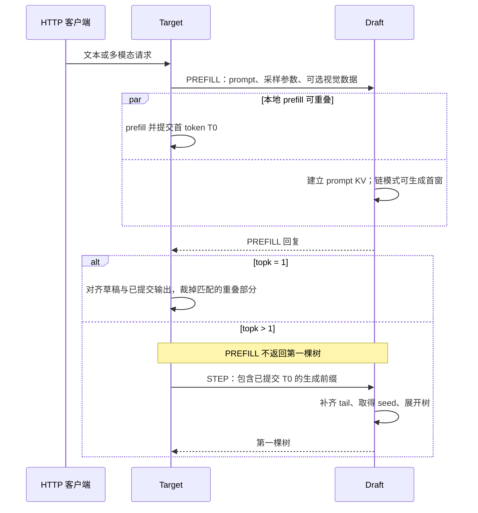
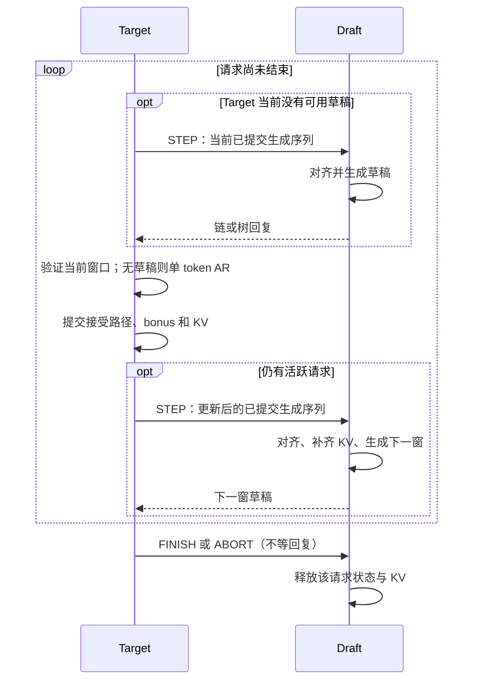

# STANDALONE_REMOTE 使用与实现说明

STANDALONE_REMOTE（下文简称 SR）把 Target 和 Draft 放在两个独立的 SGLang 进程中，
通过 **pyzmq 同步批量 RPC** 传递已提交 token 和草稿。Target 负责最终输出与验证，
Draft 负责生成候选；两端可以在同机或不同服务器运行。业务 HTTP 请求发送到 Target。

本文以当前分支实现为准，介绍链式与树状草稿、CUDA / Ascend NPU 路径及日志口径。
“有适配代码”不等于所有硬件、模型组合均已验证，也不保证投机比 Target 单独解码更快。
大小模型是常见部署方式，协议并不要求 Target 参数量一定更大。

## 目录

- [概览与支持矩阵](#overview)
- [两端协作时序](#timing)
- [Draft 如何构建草稿](#drafting)
- [Target 如何验证草稿](#verification)
- [通信协议与运行参数](#transport)
- [安装与运行示例](#examples)
- [日志字段与性能解读](#logs)
- [排查、验证与代码导航](#validation)

<a id="overview"></a>

## 概览与支持矩阵

| 项目 | SR 当前行为 |
| --- | --- |
| Target | 对外服务；发送 RPC；按 Target 分布或所选验证规则接受草稿并提交结果 |
| Draft | 绑定 RPC socket；对齐已提交前缀；生成链或树草稿；等待下一次请求 |
| 链 / 树 | `topk=1` 为链；`topk>1` 使用 STANDALONE 树展开 |
| 稳态 STEP | 阻塞 send/recv；不把下一窗 Draft 前向与本窗 Target verify 流水重叠 |
| 首次 PREFILL | 先发 RPC，Target 执行本地 prefill 后再接收回复，允许两端 prefill 重叠 |
| 传输 | Target DEALER connect，Draft ROUTER bind；控制与多模态数据在同一 multipart RPC 中 |
| KV | 各端独立维护，不跨机器传 KV；TP 通信只发生在各自服务内部 |
| 调度 | overlap scheduler 和 mixed chunked prefill 关闭；Draft HTTP 与 RPC 分时运行 |

与 [SPECTRE](../../../../../README_SPECTRE.md) 的文档结构相似，但不能照搬其时序和通信配置：
SR 不需要 SPECTRE 的 C++ ZMQ 扩展，没有独立视觉 PUB/SUB 旁路，也不使用 SPECTRE 的跨窗口流水线。

### 模型与平台范围

所有配对首先要求 **tokenizer、词表及 token ID 语义兼容**；SR 不做跨 tokenizer 映射。
模型能被 SGLang 加载，不代表其 attention、KV 布局和图模式已经满足 SR 的全部要求。

| 系列 / 能力 | 当前代码适配范围 | 验证边界与限制 |
| --- | --- | --- |
| 普通文本 causal LM | 普通自回归 Draft，加 EAGLE 风格 Target 验证；Qwen3 文本模型可作为配对示例 | 需要逐个确认模型、attention backend、采样和图能力；不宣称全部文本架构开箱即用 |
| Qwen3-VL dense | `Qwen3VLForConditionalGeneration`，纯文本、图像/视频数据及 M-RoPE 路径 | 2026-09-18 提供的 Qwen3-VL-2B 日志显示 NPU 两端树图 replay 和接受统计正常；不等于所有输入模态、尺寸及数值对照均通过 |
| Qwen3-VL MoE | `Qwen3VLMoeForConditionalGeneration` 在 SR VL 校验范围内 | 不能用 dense 2B 日志代替 MoE、其他尺寸或并行配置的验证 |
| 其他 VLM | 可能进入通用多模态路径，校验会提示超出 Qwen3-VL 已适配架构 | 不宣称开箱即用；需要核对 processor、视觉编码、占位符及位置编码 |
| 音频 | payload 存在音频相关字段 | 字段存在不代表完整音频生成/投机路径已验证 |
| Hybrid Mamba / GDN / Lightning | Target 有相应状态更新接入 | 仍需验证对应模型、Draft、状态回滚及 backend，不能套用普通 MHA 树 attention 结论 |
| CUDA / NPU | 两端各自有前向、验证及图接入；协议可连接同构或异构两端 | CUDA、跨设备类型及跨机部署需要独立验收；CPU 单测不证明硬件数值或性能 |
| 特殊 attention / KV 格式 | MLA、SWA、ALiBi、量化/NZ 等保留各自能力判断和原分派 | 不满足共享 prefix 条件时使用已有 fallback；不能推断所有组合都支持树图 |

Qwen3-VL 多模态前提：

- Target processor 已生成 padded prompt；Draft 复用这份 `input_ids` 和 `pad_value`，不再次 pad。
- 两端视觉几何（`patch_size`、`spatial_merge_size`、`temporal_patch_size`）及图像/视频 resize 设置必须兼容。
- Draft 不使用 `--skip-tokenizer-init`，需要 processor 和正确的三轴 M-RoPE。
- Draft 上下文容量必须容纳 Target pad 后的 prompt 及后续生成、投机所需空间。
- 常规视觉输入由 Draft 使用本地视觉编码路径处理；payload 也有 `precomputed_embeddings` 字段。
  已有本地视觉结果可在恢复中复用，但不传 Target 合并后的 `mm_input_embeds`。
- TP rank 0 收发 SR RPC，随后在本侧 TP 组广播；不是每个 rank 建一套跨端 socket。

<a id="timing"></a>

## 两端协作时序

### 首次 PREFILL

Target 在本地 prefill 前发送包含完整上下文的 RPC。本地 prefill 产生首个输出 token `T0`，
然后才等待 Draft 回复。这里允许重叠，不保证两端时长恰好相同或全部重叠。



链模式下，PREFILL 草稿可能从与 `T0` 相同的位置开始。Target 按已提交输出对齐，
再处理根 token 重复；不一致时丢弃不可用窗口，不是无条件删除第一个 token。
树模式 PREFILL 建立 Draft 前缀状态，第一棵树由后续 STEP 在包含 `T0` 的前缀上生成。

### 稳态 STEP



稳态通常是“验证已有窗口 → 提交 → 请求下一窗”。刚开始或草稿失效时，
同一调度轮还可能在验证前额外请求一次。因此 `rounds` 与通信 `calls` 不必一一对应。
Target 结束的请求不再请求下一窗。Draft 收到新的已提交前缀后才进行相应对齐和恢复。

Draft 可在自己的 HTTP 端口提供普通生成，但与 RPC 分时共享设备；RPC 处理中隔离其他请求，
不会把业务 HTTP 与 RPC 请求混入同一个推理 batch。性能评测时只向 Target 发流量。

<a id="drafting"></a>

## Draft 如何构建草稿

### 链：topk = 1

Draft 使用普通 AR prefill/decode 生成窗口。根据 Target 的已提交序列对齐本地状态：
可复用的草稿后缀继续保留，不足部分继续生成；发生分叉时按 KV 安全条件回滚或重新 prefill。
生成达到请求窗口预算后回包并暂停，等待下一次 RPC，不无限向前生成。

SR 参数初始化会在 `topk=1` 时将 `num_draft_tokens` 调整为 `num_steps + 1`。
例如 `steps=4/topk=1/num_draft_tokens=5`，Target 使用最多 5 个验证位置，
一轮最多输出 4 个接受的草稿 token 加 1 个 Target bonus（未提前结束时）。
传输窗口、根 token 对齐和最终验证输入是不同阶段，不应将 RPC 列表长度直接当成接受长度。

### 树：先补齐 committed tail，再展开候选

正常树路径使用一次普通 **packed EXTEND** 补齐 batch 内所有非空 tail：

```text
committed_tokens = req.origin_input_ids + req.output_ids
committed_len    = len(committed_tokens)
materialized_len = req.kv_committed_len
tail             = committed_tokens[materialized_len:committed_len]
```

两个长度都是完整序列坐标；`kv_committed_len` 表示 Draft 已实际生成 KV 的连续前缀，
不能用分配长度代替。tail 前向读取已有 prefix KV，只为缺失部分分配 KV，
末位置产生下一层候选所需的 seed `(topk_p, topk_index, None, verified_id)`，
不执行额外随机采样或追加生成 token，也不保存 recurrent hidden。
成功后统一提交边界和 seed；失败按事务路径恢复，不能直接释放可能属于旧 prefix 页的 slots。

空 tail 且 seed 边界、prefix revision 有效时直接复用；seed 失效时安全重算末位置或恢复前缀。
重复的最后一个 token 不足以证明旧 seed 有效。首次 prefill、状态损坏及不可安全复用的前缀保留恢复逻辑。
**逐 token ingest 和长 tail 全量 reprefill 不再是树模式正常路径**，链模式保留自己的处理语义。

树展开流程见 [sr_tree_drafter.py](drafter/sr_tree_drafter.py)：

1. 从 seed 取得第一层 `topk` 候选。seed 第三项固定为 `None`；旧 seed 若带 hidden 会被忽略。
2. 后续深度对保留分支进行模型前向，每个分支得到新的 top-k；用累计路径概率评分，
   选择下一轮继续前向的 `topk` 个分支，同时保存候选与父子关系。
   后续候选选择始终按 `(B*K, K)` 布局生成 `parent_rows`；需要继续模型前向时，
   沿用现有条件 remap 父节点 KV，是否重排不再依赖 hidden。最后一次选择后不再前向，
   也不新增一步 KV 搬运。
3. 分支重排后搬运对应祖先 KV；分页布局保护共享 prefix 尾页，防止兄弟分支覆盖。
   SR Draft 图不分配、不切片、不复制 unused hidden；普通 DECODE 默认 NULL。
4. `organize_draft_results` 汇总各层候选，选择 `num_draft_tokens - 1` 个候选，
   返回 `draft_tokens`、`parent_list`、`top_scores_index`。Target 后续补入自己的根 token。

例如 `steps=5/topk=3/num_draft_tokens=15`：seed 提供第一层，之后执行 **4 次模型前向**；
最终选择 14 个候选，加根组成 15 个验证位置。它不是保留所有 `3^5` 条分支的完整树，
也不是把同一条链复制三份。活跃分支宽度受 topk 限制，最终验证容量由 `num_draft_tokens` 限制；
后者不可任意增大到超过可供选择的候选数。

M-RoPE 文本续写沿已有 KV 边界递增，已有位置表覆盖的区间使用切片，超出部分使用 position delta；
正常 tail 不重新编码视觉输入。缺失位置数据或需要重新处理视觉输入时进入恢复逻辑。

<a id="verification"></a>

## Target 如何验证草稿

Target 将最新已提交 token 作为根，将候选 token 和父子关系构造成验证布局。
一次 `TARGET_VERIFY` 前向同时计算树节点：每个 query 只看共享 prefix、自己的祖先及自身，
不能读取兄弟节点。节点位置由路径深度决定，不等于扁平数组下标。

验证后选出一条可接受路径，生成 Target bonus，提交输出和这条路径的 KV，
处理其余节点的临时 KV。树分支不会全部成为最终输出，也不把 Target KV 发给 Draft。
下一次 STEP 发送新的已提交生成序列，由 Draft 对齐其独立 KV。

### 验证规则

| `--speculative-verify-mode` | 行为 |
| --- | --- |
| `auto`（默认） | 按请求采样配置判断：全 greedy 走 greedy，否则走 target-only sampling |
| `greedy` | 根据 Target argmax 沿匹配的孩子继续，不能继续时由 Target 给出后续 token |
| `target_only` | 使用 Target 概率和树采样验证路径；无需通过 SR 传 Draft 的完整概率分布 |
| `rpd` | 按相对概率下降门限判断边是否合格，选择从根出发的最长合格路径 |

远程投机所需的 `target_only` backend 能力缺失时会报错，不静默改为 greedy。
RPD 只需在 Target 设置；设父节点最优 logit 为 `z(c*)`，候选为 `z(c)`，边条件为：

```text
z(c*) - z(c) <= -ln(1 - tau),  0 <= tau < 1
```

RPD 不是每一层只锁定 top-1；不同合格孩子参与后续路径比较。`tau=0` 在实现中使用
候选 token 与 Target argmax token 相等的条件，而不只是比较 logit 数值相等，从而对齐 greedy。
`tau>0` 允许近邻候选，不保证输出逐 token 等于普通 Target greedy。

当前 RPD 有 CUDA kernel 与 CPU reference 分派；缺少 CUDA kernel 或非 CUDA 路径可使用 CPU reference。
观察 `Speculative RPD verify path` 的实际值，不应把普通 greedy/target-only 验证的耗时套用于 RPD。

NPU greedy 树核验走本仓库 [`tree_verify_npu.py`](../tree_verify_npu.py) 的 sibling-walk 设备 kernel，语义对齐 CPU [`verify_tree_greedy_ref`](../tree_verify.py) 与 CUDA `VerifyTreeGreedy`。共享入口是 `verify_tree_greedy_func`，因此 SR、SPECTRE、EAGLE/STANDALONE 中所有 greedy 调用都会走到该分派；启动 scratch 预热只接入 SR Target。CPU 张量、已识别的缺可选依赖（Triton）、或首版不支持的合法非连续布局在提交设备工作之前回退 reference；混合设备或非法 shape/dtype 报错；JIT/launch/执行失败原样上抛，不再跑 reference。不要接入 `sgl_kernel_npu.sample.verify_tree_greedy` 链入口。本优化减少 Target greedy 核验的主机往返与 Python 遍历，不解决 Draft 主瓶颈，也不能把 `accept_commit_including_wait` 整段当作可消除时间。核验之后现有结果处理仍可能读回主机。观察 `Speculative greedy verify path` 的实际值（`npu_kernel` 或 `cpu_reference` 及 reason）。设备路径依赖 Triton-Ascend JIT；具体可用版本以实机验收记录为准，当前编写环境未跑 NPU 数值对照。

默认 `auto` 配合 `temperature=0` 时，用**相同 Target 后端**的普通 AR 作为正确性基线。
不要要求 CUDA 与 NPU、不同采样种子或不同后端必然产生同样序列。
结构化输出由 Target grammar mask 保证约束；Draft 会按 committed 前缀恢复 grammar，
Draft 编译失败或降级不能代替 Target 约束。`return_logprob` 按实际接受输出处理。

### 验证容量与接受长度

`num_draft_tokens` 是一次验证的节点容量，包含根；接受的是单条路径。
`steps=5/topk=3/num_draft_tokens=15` 的树深度最多提供 5 个草稿位置，
加 bonus 的一轮输出上限为 6（还受停止条件、候选裁剪等影响），不是 15。
增加宽度可能提高命中概率，但增加计算量，不保证吞吐提升。

### CUDA / NPU 图与 attention

| 路径 | 当前行为 |
| --- | --- |
| Draft 链 | 普通 decode；满足条件时使用对应 backend 的 decode graph |
| Draft tail EXTEND | 专用 tail EXTEND 图（普通 EXTEND + `is_sr_tail_extend`）；bucket 不匹配或捕获失败时走 eager；不送入单 token decode graph |
| Draft 树 | CUDA / NPU 各自的树图 runner；捕获整段树展开，依赖深度仍然串行 |
| Draft 树 KV lease | `topk>1` 且 `page_size>1` 时按页持有独占树 KV，下一 STEP 只复制仍存活的已接受路径，再 tail-extend 剩余 token |
| Target 树验证 | 根据 batch、验证 token 数及支持的长度 bucket 捕获 / replay |
| Target 无草稿降级 | 单 token 普通 AR 当前强制 eager；存在 `r1` 图不代表该路径会使用它 |

NPU 对能力检查通过的 SR 普通 MHA/GQA 树路径，在图捕获前固定选择实现：
合格 NPU Draft（`topk>1` 且 `page_size>1`）**默认**使用原生分页树 attention
（`paged_atb` / `paged_fia`），无需设置 `SGLANG_NPU_SR_TREE_PAGED=1`。
启动前设置 `SGLANG_NPU_SR_TREE_PAGED=0` 可恢复 compact-FIA；该变量只在 Draft
初始化时读取，不是运行时热切换。`ASCEND_USE_FIA` 决定 Draft 分页树走 ATB 还是 FIA，
与 tail 的 FIA 开关是不同维度。该默认值不影响 Target、CUDA 和 tail EXTEND。
eager 分页树能力不受草稿图捕获 batch 上限约束：`prepare_sr_tree_paged_eager`
只绑定本轮新建的页表，图缓冲区归 `bind_sr_tree_paged_replay` 所有。
eager 只量化 `block_tables` 的 query 宽度：`page_buckets` 由 `tree_kv_buckets`
推出（`page_size=128` 时为 `2/4/8`），经 `quantize_page_width` 取最小可容桶，
超出最大桶时退到 2 的幂；只放宽不收窄，多出的列填 `dummy_page`，
`assemble_block_tables` 仍按真实 `n_shared` / `n_query` 限制读取范围。
`shared` 与 `branch` 中间张量保持数据相关的原始页数，不再一起抬到桶宽：加宽它们
每轮多出约 0.2-0.3ms 主机时间，而预热一旦枚举原始 shared 页数就已覆盖全部可达
形状，收益为零。图键选择走 `select_page_bucket`，与 eager 表宽量化独立。`raw_bs` 超出草稿图已捕获 `capture_bs` 时走一次批量
eager，不再因图缓冲区行数不足抛裸 `RuntimeError` 并触发请求隔离。草稿图
`capture_bs` 默认跟随 `--cuda-graph-bs`；仅当显式设置
`SGLANG_NPU_TREE_DRAFT_CAPTURE_BS` 时才按该环境变量求交集限制。分页树的容量
类失败统一为可回退的 `NpuGraphPreparationError`（`scope="graph"`）。草稿图的
`block_table` 与 `active` 都按 `(rows, pages)` 分配独立连续缓冲，不再从一块
`(max_q, max_pages)` 共享张量切片；replay 缺键或缓冲不连续同样回退 eager。
`SGLANG_NPU_TREE_DRAFT_CAPTURE_BS=1,2` 只作显式收窄/兜底，不是默认规避。
`SGLANG_NPU_SR_TREE_WARMUP` 控制 **SR 两端图外预热**（Draft layout / alloc /
mapping 与 Target kernel）。默认开启；`=0` 跳过新增与已有预热。不新增 CLI。
`raw_batch_sizes` 为 `range(1, upper+1)`，`upper = min(max(configured_capture_bs),
req_to_token_rows, 非空的 max_running_requests / standalone_remote_max_batch_size)`。
`cuda_graph_max_bs` **不单独**作为 upper。没有配置 capture 尺寸则跳过本组新增预热。
本次实验 `capture_bs=[1,2,4]` 且容量 ≥4 时应得到 `1,2,3,4`。

`SGLANG_NPU_SR_TREE_UPDATE_OVERLAP` 是 **默认开启** 的 SR Draft 分页树开关：
后台线程执行 `graph.update`，主线程同时 `graph.replay`，提交返回前 join。
未设置或 `=1` 请求启用；`=0` 回退串行。只在 Draft 初始化时读取，需重启 Draft，
不是运行时热切换，也不是 CLI/协议字段。仅 `paged_atb` / `paged_fia` 在图可用且
成功取得 `torch.npu.current_device()` 后 `effective=True`。图捕获失败仍按现有
图初始化失败处理，不会被关掉 overlap 掩盖。设备绑定只走这条分页重叠路径，
不影响 compact-FIA 的 `SGLANG_NPU_TREE_FIA_SERIAL_UPDATE`、CUDA 和普通
EAGLE/STANDALONE。Target `tree_paged_fia` 与 tail EXTEND 同样默认重叠，各自设
`0` 才回退串行，并通过各自门控后 `effective=True`。后台线程显式 `daemon=False`。
join 只证明 `update()` 返回，不证明设备图已执行结束。线程启动失败不调用 replay，
沿树展开已有 in-flight 路径：先 `_try_confirm_tree_completion()`，确认失败则按
submitted 处理，禁止回滚 allocator / 提前释放 lease。ATB 与 FIA 共用实现，但
必须分别验收。

`SGLANG_NPU_SR_FIXED_ACCEPT` 默认开启 SR Target 的固定容量接受后处理。
未设置或 `1/true/yes/on` 请求启用；`0/false/no/off` 使用原来的 V1 接受后处理。
只在 Target 初始化时读取一次，改值后需重启 Target，不是运行时热切换，也没有
执行中自动回退。首版只覆盖 NPU、普通 MHA 六维分页 KV、`topk>1`、greedy、
`page_size>1`。采样、RPD、grammar、logprob、hidden 返回、混合状态、
自定义 logit processor、CUDA、单链、非分页、模拟接受长度，以及宽度或
allocator 不匹配的批次在写工作区之前走 V1。Qwen3-VL dense
（`Qwen3VLForConditionalGeneration`）和 MoE
（`Qwen3VLMoeForConditionalGeneration`）在 prefill 完成后的
`TARGET_VERIFY` 轮次可以走这条快路径，包括图像、视频以及文本与多模态混批。
其他 VLM 的多模态请求仍在写工作区之前整批回退 V1。`=0` 后需重启 Target
才回到 V1。penalty 与 logit bias 仍在验证前处理。进入快路径后出错直接上抛，
不重跑验证。实际输出和 KV 边界增量是含 bonus 的 `A`；返回的
`accept_length_per_req_cpu` 仍是 `A-1`。主机结果组装完成后才提交 KV 搬移，主机不等待搬移结束。本机尚未做实机对照：`=0`、未设置、
显式 `1` 应各自预热后交替至少 3 次、每次至少 500 个稳态轮次，先 TP=1 再实际
TP，dense 与 MoE 分开。正确性看输出、接受路径、已提交 KV 和 Draft 下一轮
seed。实机还要确认 Target 图里未清零的 M-RoPE padding 不影响真实请求输出。
性能要分开看接受后处理、Target 本地、整轮和端到端，以及 prefill/TTFT，不要把
原来等待前向或视觉编码的时间算成收益。

`SGLANG_NPU_SR_TARGET_UPDATE_OVERLAP` 与 `SGLANG_NPU_SR_TAIL_UPDATE_OVERLAP`
默认开启，解析方式与 Draft 树开关相同（未设置或 `1/true/yes/on` 请求启用，
`0/false/no/off` 回退串行）。只在对应进程的 runner
初始化时读取一次，改值后需重启该进程，不是运行时热切换，也不是 CLI/协议字段。
Target 开关只作用于 SR Target 的 `tree_paged_fia` 验证图：图已捕获、至少一个
FIA 映射有效，且 `torch.npu.current_device()` 成功后 `effective=True`。当前轮
映射缺失仍在提交前失败。Tail 开关作用于 SR tail-extend 图的 ATB 与 FIA；
`disabled_reason`、无图或普通 `current_device()` 失败时保持关闭。设备上下文错误
继续上抛，不用关掉 overlap 掩盖图初始化失败。非 SR runner 即使解析到 Target
开关也不会走新分支；未请求时不打印初始化日志。

开启后，主线程先填好本轮 payload，再把局部 `graph`、`payload`、设备号交给共享
helper：后台线程 `set_device` 后 `graph.update`，主线程 `graph.replay`，返回前
join。关闭时 Target 仍把填充留在原来的 update 调用里。`submit_envelope` 在两条
路径上的范围不同，比较主机时间用 `prepare_submit_total_host_ms`（从填充前到
helper 返回或抛错）。`submit_envelope` 接近 `max(update, replay)` 不能证明发生了
重叠，也不能证明隐藏了设备时间。join 只证明更新线程结束。线程启动失败不补一次
串行提交；tail 仍按现有 TP、rollback 和 KV lease 条件处理。

四组实机验收固定当前 Draft 树重叠配置，显式切换这两个开关：基线两个都设
`0`、只关 Tail、只关 Target、以及默认两者都不设置（都开）。未设置不再等于
基线。每组先预热，至少重复三次，每次至少 500 个稳态轮次，基线与实验交替。
正确性比较 greedy 输出、接受路径、提交长度和已提交 KV。收益看整轮和端到端，
不看单独的 replay 提交变快。出现正确性差异或没有稳定收益时，把对应开关设为
`0` 并重启该进程。测量数字在实跑后补记。

启动期 Draft `_sr_warm_tree_shapes` 先做 layout：对每个 raw_bs 枚举
`shared ∈ [0, max(page_buckets)]` 的**原始页数**（不是桶值）与
`rem ∈ {1, page_size - num_steps + 1, page_size - 1}`，
`prefix = shared * page_size + rem`。枚举桶值是无效的：`n_query` 恒为
`shared + 1` 或 `shared + 2`，只取桶值永远碰不到真实 prefix 产生的
`(shared, width)` 组合。三个 `rem` 恰好张开全部可达的 `(nnp, n_query)` 组合：
`1` → `nnp=1, n_query=shared+1`；`page_size - num_steps + 1` → `nnp=2` 但
`n_query` 仍是 `shared+1`；`page_size - 1` → `nnp=2, n_query=shared+2`；
`nnp=1` 配 `shared+2` 不可达。三者 `remainder != 0`。NPU 分页路径对每个去重后的
形状调用生产函数 `prepare_sr_tree_paged_eager`（`ALLOC_ORDINARY` 与 `ALLOC_LEASE`
各一次），`req_pool_indices` 用互异的 `arange(bs)`，`slots` 用非零值，从而覆盖
view / prefix-tail copy / 五个 step bind。全部 combo 结束后调用
`_sr_clear_paged_round_state`，避免脏 `_paged_round_*` 泄漏进第一轮请求。
没有该生产函数时（CUDA / 无分页 backend）退回 builder 旁路
`prepare_tree_paged_view` / `build_step_context_lens`。`page_size=128` 时约 63 组。
`test_warmup_rem_ladder_covers_every_reachable_shape` 锁住形状覆盖不变量。预热完
成的 combos 写入 `_seen_tree_paged_shapes`，因此稳态 `tree_shape_first_use` 应为 0。

随后 Draft 在独立 warmup host 上走真实 alloc/mapping（绑定生产方法，不改生产
scheduler / lease store）。lease 场景 `sr_tree_leases is None`；ordinary 场景
`_lease_supported()` 固定为 False。prefix 经 `paged_tree_mapping_fits`：
`page=128, steps=5` 代表 `128/129/252/255`。`steps > page` 时 remainder 含跳变两侧
（`page=128, steps=133` 为 `123→124`，nnp 2→3）；合法 remainder 内无跳变记不可达，
不是预热失败。无驱逐 cache adapter 与 tracking allocator 覆盖 `alloc` /
`alloc_extend` / `free`；`alloc_extend` 只把新增页记入账本。外层先快照
`free_pages/release_pages`；同步失败或归属不明抛 `SRWarmupFatalError` 并中止
init，不被 `_sr_warm_tree_shapes` 的 warning 吞掉。已确认恢复成功的普通失败才记
未覆盖并继续。日志分别报告 `layout=` / `allocation=` / `mapping=`，不用单个
`alloc_bs` 表示全覆盖。

NPU Target（`page_size>1` 且 `topk>1`）在 `StandaloneRemoteWorker` 初始化末尾做
图外 kernel 预热：`alloc_paged_token_slots_extend` + `assign_req_to_token_pool_func`、
`get_src_tgt_cache_loc` / `get_target_cache_loc`、部分完成才
`filter_finished_cache_loc_kernel`、`copy_paged_kv_buffer_by_slot`。跨页按验证宽度
`speculative_num_draft_tokens` 生成 keep/free；零释放看空 slot 与页集合，不要求
`free()` 调用次数为 0。不跑真实 `verify()`，不改 output token / 请求统计 / radix。
AR 与 SR 图回放策略不变。本补丁只覆盖已枚举路径的首次编译/tiling，不承诺消除
整个服务的所有首次开销。
实机确认 bs=4 命中图：草稿启动日志含 `4_s2/4_s4/4_s8`；`[SR Draft round]
counters` 中 `tree_eager_batches` 为 0；`tree_forward` host 回到约 11-13ms；
无 `ACL stream synchronize failed, error code:507011`。rows=12 上若复现
507011，用 `SGLANG_NPU_TREE_DRAFT_CAPTURE_BS=1,2` 收窄。

合格 NPU Target（`STANDALONE_REMOTE`、`topk>1`、page size 128、普通可 view 的
MHA/GQA、FP16/BF16）**默认**使用 `tree_paged_fia`：原始 paged KV + 每请求线性页表
+ `[B,1,Q,S]` 树 mask，每层一次 BSND FIA（`sparse_mode=0`）。这与旧 TND 路径
（`FIA_TREE_MASK_CONTRACT`，`fia_consumes_mask=False`）不同，见
`FIA_TREE_MASK_CONTRACT_BSND`。启动前设置 `SGLANG_NPU_SR_TARGET_TREE_FIA=0`
可恢复 `shared_prefix_torch`；该变量只在 Target 初始化时读取，不依赖
`ASCEND_USE_FIA`，也不是运行时热切换。能力不满足、或 DP attention / CP / PP /
TBO / PDMux 等首版未覆盖组合，保留当前 Target 选择并记录原因。

共享 prefix 仍按请求分块 gather prefix KV，与祖先路径统一 softmax。
能力不满足时保留 compact-FIA / chunked 等原分派，不在已捕获图内部临时换算子。
特殊布局不能套用这条选择规则。请以捕获和 replay 日志中的 `implementation`
判断实际运行路径。
共享 prefix 与 Target FIA 的首版能力范围包括 FP16/BF16、普通可 view 的 MHA/GQA cache、
同维 K/V、head dimension 64/128；实际是否启用还取决于所有相关层的能力检查。

`ASCEND_USE_FIA` 未设置或为 `0` 时，当前 NPU 普通 MHA/GQA 的 tail 使用 paged ATB；
为 `1` 时使用 paged FIA。**tail 的这个开关与树 attention 的实现选择是不同维度**。
`shared_prefix_torch` replay 跳过 FIA 长度 update；`tree_paged_fia` 按层更新 B 个
`P+Q` 长度；compact-FIA 保留相应更新和 scratch。
两端 page size 是本地 KV/backend 配置，不在 SR 协议中交换；示例使用相同值便于排查，
不把相同 page size 作为 wire 协议要求。

树 KV lease 只复用**搬运后仍存活**的已接受路径 KV，不承诺所有非末层节点可复用。
页数随 prefix 余数 `r` 变化：`pages_per_branch = ceil((r + steps) / page_size)`。
对 `topk=3、steps=5、page_size=128`（不是通用常量）：`r=0/123` 为 3 页/请求，
`r=124/127` 为 6 页/请求。`reusable_depth>=2` 与页预算是实验策略。
正确性以 KV/seed 与完整 tail 参考一致、无页泄漏为准；吞吐是否下降要单独看整轮耗时
和页驻留，不能为了加速放松约束。CPU 图替身只覆盖 buffer 生命周期；NPU 连续 replay 需实机验证。

<a id="transport"></a>

## 通信协议与运行参数

实现见 [sr_protocol.py](sr_protocol.py)、[sr_transport.py](sr_transport.py)
和 [sr_mm_payload.py](sr_mm_payload.py)。控制对象用 pickle 序列化，多模态元数据和 buffer
作为同一 multipart 的附加帧。RPC 只用于可信服务之间；HTTP 端口与内部 RPC 端口是两回事。

### 地址、身份与帧

| 地址配置 | Draft bind | Target connect |
| --- | --- | --- |
| 两端 `127.0.0.1` | `ipc:///tmp/sr_127_0_0_1_30019` | 同一个 IPC 路径 |
| 两端 `0.0.0.0` | `ipc:///tmp/sr_0_0_0_0_30019` | 同一个 IPC 路径 |
| Draft 可达 IP / 主机名 | `tcp://*:30019` | `tcp://<Draft地址>:30019` |

上表使用默认 RPC 端口。`0.0.0.0` **不会触发 TCP bind**；也不能让一侧填 `127.0.0.1`、
另一侧填 `0.0.0.0` 来连接同一个 IPC socket，因为路径不同。跨机使用可达的 Draft 地址和相同端口。

```text
Target → Draft：SRCTRL | pickle(batch request) | [SRMM | pickle(mm metas) | buffers...]
Draft  → Target：SRCTRL | pickle(batch reply)
```

ROUTER 收发时还有路由 identity；上图只列应用帧。视觉 buffer 与控制帧同一次 RPC 收发，
无需额外 mm 端口。纯文本请求没有 `SRMM`。不传模型权重、跨端 KV、Target 语言模型 logits/hidden；
多模态 item 可包含视觉 feature / precomputed embeddings，不能将其混同为语言模型 hidden 传输。

### 批次与请求字段

| 层级 / 字段 | 含义 |
| --- | --- |
| batch `session_id` | Target 会话身份，避免旧进程或旧会话回复被复用 |
| batch `rpc_seq` | 会话内批次 RPC 序号；请求与回复对应 |
| request batch `action` | `prefill/step/finish/abort`；后两者不等待回复 |
| batch `reqs` | 本次批量处理的请求列表 |
| request `rid` | 单个生成请求的身份 |
| request `step_id` | 该请求的投机步骤身份 |
| request `base_committed_len` | `len(origin_input_ids) + len(output_ids)`，包含 prompt 的完整已提交长度 |
| request `committed_ids` | Target 全部已提交的**生成 token**，即 `output_ids`；不含 prompt，也不只是本轮新增 tail |
| request `num_draft_tokens` | 本次窗口预算；FINISH 使用 0，FINISH/ABORT 均按控制动作处理 |
| request `padded_input_ids` | 完整上下文发送时携带的 prompt；VL 时已 pad |
| request `sampling_params` | 完整上下文发送时携带采样、停止条件及结构化输出配置 |
| request `has_mm` | 本次是否附带多模态 payload，不等于该请求永远没有视觉状态 |

### 回复与多模态字段

| 字段 | 含义 |
| --- | --- |
| reply batch `session_id/rpc_seq` | 匹配请求批次 |
| reply batch `draft_residence_ns` | 可选的 Draft 本机驻留持续时间，纳秒；不是跨机绝对时间戳 |
| reply item `rid/step_id/base_committed_len` | 匹配 Target pending 请求及其前缀边界 |
| reply item `status` | `ok` 正常、`empty` 空窗、`idempotent` 复用已生成窗口、`reject` 拒绝；Target 接入草稿要求 ok/idempotent 且 token 非空 |
| reply item `draft_tokens` | 草稿 token ID；空窗允许 Target 降级 |
| reply item `parent_list/top_scores_index` | 树拓扑与候选选择索引，Target 据此重建树；不是分数或完整 logits |
| mm `rid/padded_input_ids/mm_items` | 请求身份、已 pad 的 prompt、图像/视频等 item 列表 |
| mm item | modality、format、hash、pad_value、offsets、feature、precomputed_embeddings、model_specific_data |
| mm 特殊 token | image/video/audio/slice 等标记 ID；音频字段存在不证明完整音频路径可用 |

新 Target 收到旧 Draft 缺少驻留字段的回复仍可处理；旧 Target 忽略新增可选字段。
采样参数是已有子结构的序列化内容，不在 SR 中重新定义另一套用户采样 API。

### SR 专用参数

默认值见 [server_args.py](../../server_args.py)。

| 参数 | 默认值 | 生效位置 / 含义 |
| --- | --- | --- |
| `--standalone-remote-role` | 无，必须指定 | 两端分别填 `target` / `draft` |
| `--standalone-remote-addr` | `127.0.0.1` | 两端，按上述规则选择 IPC / TCP |
| `--standalone-remote-port` | `30019` | 两端，RPC 端口或 IPC 路径标识，不是 HTTP 端口 |
| `--standalone-remote-rpc-timeout-ms` | `5000` | Target 接收匹配回复的等待预算；从进入接收接口计时，不是请求打包开始 |
| `--standalone-remote-max-batch-size` | `32` | Target batch 超限时普通解码；Draft running batch / HTTP 请求数超限时快速 REJECT |
| `--standalone-remote-draft-ttl-s` | `60.0` | Draft 空闲 RPC 状态清理，单位秒；`<=0` 关闭，当前 RPC 涉及的请求不清理 |
| `--standalone-remote-breaker-failures` | `3` | Target 连续失败阈值；超时及发送/接收失败可触发；REJECT 是活跃回复 |
| `--standalone-remote-breaker-cooldown` | `32` | 熔断 OPEN 后跳过的 decode 步数，之后进入 HALF_OPEN 探测；不是秒 |

### 邻近投机与设备参数

| 参数 | 默认 / SR 行为 | 用法 |
| --- | --- | --- |
| `--speculative-algorithm` | 两端显式设 `STANDALONE_REMOTE` | 两端各自加载 `model-path`，不配置同进程 `speculative-draft-model-path` |
| `--speculative-num-steps` | SR 未指定时 3 | Draft 展开深度；两端显式一致 |
| `--speculative-eagle-topk` | SR 未指定时 1 | 链 / 树及活跃分支宽度；两端显式一致 |
| `--speculative-num-draft-tokens` | 未指定时 `steps+1` | 验证节点预算；链模式强制 `steps+1`，树模式显式选择；两端一致 |
| `--speculative-verify-mode` | `auto` | Target 验证规则 |
| `--speculative-rpd-tau` | `0.2` | Target RPD 门限，范围 `[0,1)`；只在 rpd 生效 |
| `--device` / `--attention-backend` | 依平台自动选择 | NPU 示例显式设 `npu/ascend`；CUDA 文本示例设 `cuda/triton` |
| `--tp-size` | 1 | 本侧 TP 大小，两端可以不同；别名 `--tensor-parallel-size`，需满足模型 head 数等约束 |
| `--base-gpu-id` | 0 | 本侧起始可见设备编号；配合设备可见性，避免两进程意外共用物理设备 |
| `--page-size` | 由 backend 推导 | CUDA 示例 1，NPU 示例 128；不是跨端协议参数 |
| `--context-length` | 从模型配置推导 | 容纳 pad 后输入、生成与投机，不能只按原始文本长度估算 |
| `--max-running-requests` | SR 未指定时调整为 48 | 服务调度容量，不等于 SR RPC 上限 32；超限可能降级 |
| `--disable-cuda-graph` | 默认不禁用 | 同时控制 CUDA/NPU 图；添加后使用 eager，移除后才可能捕获/replay |
| `--cuda-graph-max-bs` / `--cuda-graph-bs` | 自动推导 | 图捕获 batch 范围，不代表任意 batch 均能 replay |
| `--skip-server-warmup` | 默认 False | 示例两端均开启，避免未就绪的 Draft 和 HTTP warmup 干扰 |
| `--host` / `--port` | `127.0.0.1` / `30000` | HTTP 服务；同机 Draft 示例使用另一 HTTP 端口 30008 |
| `--decode-log-interval` | 40 | 通用 Decode 日志频率；不改变 SR 每 32 次通信/整轮窗口 |
| `--enable-metrics` | 默认关闭 | 启用指标采集；SR INFO 计时日志不要求开启它 |

### 超时、过期回复与容错

Target 在接收 deadline 内丢弃不匹配的 `session_id/rpc_seq`；不会因旧回复到达而重置 deadline。
匹配批次还要检查 rid 是否 pending，以及 `step_id/base_committed_len`。后两项在调度层检查，
所以通信 `success` 不等于所有 item 可验证。每次发送前 drain 旧回复，超时默认重建 DEALER。

Target 无可用草稿时退到单 token AR。熔断 OPEN 时跳过 STEP，冷却后探测；PREFILL 仍可发送。
收到 REJECT 表示 Draft 活跃，不按超时处理。`/flush_cache` 重置相关会话/熔断状态。
FINISH/ABORT 发送后不等待确认，TTL 负责清理没有收到结束通知的空闲请求。
Draft 树初始化失败、图捕获失败与已提交设备错误不是一回事；已提交 replay/设备上下文错误
沿 worker 错误路径传播，不能当作普通空窗反复重试。

<a id="examples"></a>

## 安装与运行示例

以下为 **Linux Bash 模板**，从仓库根目录执行。模型路径和设备编号均需替换，
不是仓库默认配置或速度承诺。完整运行需要匹配 CUDA/NPU 的 SGLang、PyTorch 和 backend 依赖。
不要为运行示例直接覆盖现有环境；平台安装说明以仓库主文档和环境配置为准。

```bash
# 在已准备好平台依赖的环境内安装当前源码；根目录不是 Python 包
python -m pip install -e "python"
python -c "import zmq; print('pyzmq:', zmq.__version__)"
```

SR 的传输不要求编译 `spectre_zmq`。不要照搬 SPECTRE 的 C++ 扩展构建或 mm 旁路端口配置。
两端建议使用同一份代码。先启动 Target，再启动 Draft；两端 ready 后才发送测试请求。
两端都带 `--skip-server-warmup`，使先启动的 Target 不会立即向尚未就绪的 Draft 发预热请求。

### CUDA 文本链式冒烟

以 Qwen3 文本系列的兼容 tokenizer 配对为例。终端 1，Target 使用可见 GPU 0：

```bash
CUDA_VISIBLE_DEVICES=0 python -m sglang.launch_server \
  --model-path /path/to/Qwen3-1.7B \
  --device cuda --attention-backend triton --tp-size 1 \
  --speculative-algorithm STANDALONE_REMOTE \
  --standalone-remote-role target \
  --speculative-num-steps 3 \
  --speculative-eagle-topk 1 \
  --speculative-num-draft-tokens 4 \
  --speculative-verify-mode auto \
  --standalone-remote-addr "${SR_ADDR:-127.0.0.1}" \
  --standalone-remote-port "${SR_RPC_PORT:-30019}" \
  --page-size 1 --max-running-requests 1 \
  --disable-cuda-graph --skip-server-warmup \
  --host 127.0.0.1 --port 30000 --log-level info
```

终端 2，Draft 使用另一张 GPU：

```bash
CUDA_VISIBLE_DEVICES=1 python -m sglang.launch_server \
  --model-path /path/to/Qwen3-0.6B \
  --device cuda --attention-backend triton --tp-size 1 \
  --speculative-algorithm STANDALONE_REMOTE \
  --standalone-remote-role draft \
  --speculative-num-steps 3 \
  --speculative-eagle-topk 1 \
  --speculative-num-draft-tokens 4 \
  --standalone-remote-addr "${SR_ADDR:-127.0.0.1}" \
  --standalone-remote-port "${SR_RPC_PORT:-30019}" \
  --page-size 1 --max-running-requests 1 \
  --disable-cuda-graph --skip-server-warmup \
  --host 127.0.0.1 --port 30008 --log-level info
```

两侧均先用 eager 做短请求正确性对照，再移除 `--disable-cuda-graph` 验证图执行。
Qwen3-0.6B/1.7B 是配置示例，不是本次 NPU Qwen3-VL 日志已经验证的模型组合。

### NPU Qwen3-VL 树模式

以下演示大 Target、小 Draft 配置，TP 均为 1，分别使用当前可见设备编号 0 和 1。
已有运行日志来自 **2B Target + 2B Draft**，不等于下面 8B/2B 配对已经验收。
可先两端都设为同一份 2B 权重做功能对照，再更换 Target；上下文容量和显存需按实际硬件调整。
若 shell 已限制可见设备，先确认 `--base-gpu-id` 对应的物理设备，避免设备重叠。

终端 1，Target：

```bash
python -m sglang.launch_server \
  --model-path /path/to/Qwen3-VL-8B-Instruct \
  --device npu --attention-backend ascend --tp-size 1 --base-gpu-id 0 \
  --speculative-algorithm STANDALONE_REMOTE \
  --standalone-remote-role target \
  --speculative-num-steps 5 \
  --speculative-eagle-topk 3 \
  --speculative-num-draft-tokens 15 \
  --speculative-verify-mode auto \
  --standalone-remote-addr "${SR_ADDR:-127.0.0.1}" \
  --standalone-remote-port "${SR_RPC_PORT:-30019}" \
  --context-length 8192 --page-size 128 --max-running-requests 1 \
  --cuda-graph-max-bs 1 --skip-server-warmup \
  --host 127.0.0.1 --port 30000 --log-level info
```

终端 2，Draft：

```bash
python -m sglang.launch_server \
  --model-path /path/to/Qwen3-VL-2B-Instruct \
  --device npu --attention-backend ascend --tp-size 1 --base-gpu-id 1 \
  --speculative-algorithm STANDALONE_REMOTE \
  --standalone-remote-role draft \
  --speculative-num-steps 5 \
  --speculative-eagle-topk 3 \
  --speculative-num-draft-tokens 15 \
  --standalone-remote-addr "${SR_ADDR:-127.0.0.1}" \
  --standalone-remote-port "${SR_RPC_PORT:-30019}" \
  --context-length 8192 --page-size 128 --max-running-requests 1 \
  --cuda-graph-max-bs 1 --skip-server-warmup \
  --host 127.0.0.1 --port 30008 --log-level info
```

这组命令允许图捕获；做 eager 对照时在**两端**追加 `--disable-cuda-graph`，再移除比较。
`--cuda-graph-max-bs 1` 控制捕获规模，不代表所有 prefix 长度都有相应图。
确认日志中的实际 `implementation`、`tree_graph_captured`、replay 计数和 fallback，
不要只看 `disable_cuda_graph=False`。普通 NPU tail 默认走 paged ATB；不需要为树图强制设置 `ASCEND_USE_FIA=1`。

### 跨机 TCP

复用上述完整命令，只在两个终端分别设置地址与 RPC 端口。以下 IP 属于文档示例地址，必须替换。

```bash
# Target 主机：填 Draft 可达地址；随后执行上述 Target 命令
export SR_ADDR=192.0.2.20
export SR_RPC_PORT=30019
```

```bash
# Draft 主机：同样使用非回环地址以选择 TCP；随后执行上述 Draft 命令
export SR_ADDR=192.0.2.20
export SR_RPC_PORT=30019
```

Draft 实际 bind `tcp://*:30019`，Target connect `tcp://192.0.2.20:30019`。
不要把 Draft 的 SR 地址换成 `0.0.0.0`，那会变为 IPC。设备编号按每台机器本地布局选择。
若外部客户端访问 Target HTTP，再将 Target 的 `--host` 改为合适的监听地址，
并使用 Target 主机的 HTTP 地址；这与 Draft RPC 地址没有关系。

### 向 Target 发送文本请求

```bash
curl -sS http://127.0.0.1:30000/generate \
  -H 'Content-Type: application/json' \
  -d '{
    "text": "The capital of France is",
    "sampling_params": {"temperature": 0, "max_new_tokens": 32}
  }'
```

`/generate` 的 `text` 是原始 prompt；对 Instruct 模型需要 chat 格式时，使用对应模板或 chat API。
采样、停止条件和 prompt 必须与普通 Target AR 对照保持一致。

### 向 Qwen3-VL Target 发送图片请求

以下 Python 客户端只读取一张本地图片，用 Qwen3-VL 的图像占位符和对话标记调用 `/generate`。
客户端不预先 pad 视觉 token，不创建 Draft 侧 KV；pad 由 Target processor 完成。

```bash
export IMAGE_PATH=/path/to/example.jpg
export TARGET_URL=http://127.0.0.1:30000
python - <<'PY'
import base64
import json
import mimetypes
import os
import urllib.request
from pathlib import Path

path = Path(os.environ["IMAGE_PATH"])
mime = mimetypes.guess_type(path.name)[0] or "image/jpeg"
image = base64.b64encode(path.read_bytes()).decode("ascii")
prompt = (
    "<|im_start|>user\n"
    "<|vision_start|><|image_pad|><|vision_end|>"
    "请简要描述这张图片。<|im_end|>\n<|im_start|>assistant\n"
)
payload = {
    "text": prompt,
    "image_data": [f"data:{mime};base64,{image}"],
    "sampling_params": {"temperature": 0, "max_new_tokens": 64},
}
request = urllib.request.Request(
    os.environ["TARGET_URL"].rstrip("/") + "/generate",
    data=json.dumps(payload).encode("utf-8"),
    headers={"Content-Type": "application/json"},
)
with urllib.request.urlopen(request, timeout=120) as response:
    print(response.read().decode("utf-8"))
PY
```

更换模型系列时不要直接复用上述特殊 token 模板。图像分辨率、视频帧数会显著增加 pad 后序列长度，
先确认两端容量及 processor 设置，再扩展多图/视频测试。

### 可选 RPD

只在 Target 命令中把 `--speculative-verify-mode auto` 替换为：

```bash
  --speculative-verify-mode rpd \
  --speculative-rpd-tau 0.2
```

不要同时保留两份 `--speculative-verify-mode`。`tau>0` 改变接受规则，应单独记录质量和吞吐；
不能仅凭更长接受路径就宣称与 greedy 等价。

<a id="logs"></a>

## 日志字段与性能解读

先看实际路径，再看接受长度和整轮耗时，最后定位子阶段。日志时间是输出时间，
不是该窗口第一条请求的开始时间。下面的实测数字仅用于解释口径，不是模型或设备的性能承诺。

### 通信日志：SR Comm Target / Draft

实际持有 socket 的 TP rank 0 输出 `[SR Comm Target]` / `[SR Comm Draft]`。
每个 action 首次成功输出 `kind=sample`，每 32 次完成或失败调用输出 `kind=window`；
正常调用 transport `close()` 时刷新剩余窗口。首个 sample 同时包含在后续 window 中，不要重复计数。
FINISH/ABORT 不建立等待回复的 RPC 样本，Draft 空闲接收轮询超时也不计作失败 RPC。

| 字段 | 含义 |
| --- | --- |
| `TP0` | 日志所属的本侧 TP rank；单 rank 日志可能不显示 TP 标记 |
| `transport` | 实际使用的 `ipc/tcp` |
| `action` | `prefill/step/finish/abort`；无法识别请求时可归为 `unknown` |
| `kind` | `sample` 单个样本；`window` 有界统计窗口 |
| `calls` | 窗口完成或失败调用数，不是 token 数、用户请求数或验证轮数 |
| `counts` | 调用结果和辅助事件计数；丢弃多个过期回复等事件不会各自完成一次 RPC |
| `stats` | 每个时间或字节指标的有效样本分布 |
| `bytes_total` | 窗口应用字节总数；包含控制头，排除 ROUTER identity，不含全部底层协议开销 |

`stats` 的单位由字段决定：`*_ms` 为毫秒，`*_bytes` 为字节。
`n` 是该项有效样本数；`mean` 是平均；`p50/p95` 使用 nearest-rank 分位数；`max` 是最大值。
32 个排序样本的 p50 取第 16 个，p95 取第 31 个。每项独立计算，不能将两个 p95 相减得到差值的 p95。
旧端或失败调用可能缺少部分指标，其 `n` 不一定等于 `calls`，缺失值不补零。

| 指标 | 输出端 | 计时边界 |
| --- | --- | --- |
| `request_pack_ms` | Target | 请求打包耗时，包括已有的多模态序列化 |
| `request_send_host_ms` | Target | 调用 `send_multipart()` 到返回；不表示对端已经收到 |
| `recv_entry_gap_ms` | Target | 发送调用返回，到进入接收接口的间隔；PREFILL 中包含 Target 本地计算 |
| `rpc_elapsed_ms` | Target | 请求打包开始，到 session/rpc_seq 匹配的回复解包完成 |
| `reply_unpack_ms` | Target | 匹配回复的解包耗时，不是等待回复的总时间 |
| `draft_residence_ms` | 两端 | Draft socket 收包返回，到回复打包开始；包含解包、TP 广播、调度、前向和相关等待 |
| `non_draft_elapsed_ms` | Target | 同一次 RPC 的 `rpc_elapsed_ms - draft_residence_ms`，先逐次计算，再统计分布 |
| `request_unpack_ms` | Draft | 请求解包耗时，已经包含在驻留时间内 |
| `reply_pack_ms` | Draft | 回复序列化打包耗时，在驻留区间之后 |
| `reply_send_host_ms` | Draft | 回复发送的主机调用耗时，不代表 Target 已收包 |
| `request_bytes/reply_bytes` | 两端 | 对应应用 multipart 的 buffer 字节数；统计长度本身不额外复制多模态数据 |

两端只传本机 `perf_counter_ns()` 的持续时间，不直接相减两台机器的时间戳，不要求时钟同步。
剩余耗时包含序列化、传输、排队、Target 延后收包等因素，**不是纯网络延迟，不能除以二估算单向延迟**。
`recv_entry_gap_ms` 可以与 Draft 处理重叠，可能大于剩余耗时，不能重复相加。
PREFILL 和 STEP 必须分开看；日志中的 `transport=ipc` 不能用于推断跨机 TCP 性能。

通信计数器按发生情况输出：

| 计数 | 解释 |
| --- | --- |
| `success` | Target：收到可解包且 session/rpc_seq 匹配的回复；Draft：匹配请求的回复发送调用成功返回；均不代表候选被接受 |
| `timeout` | Target 未在接收 deadline 内取得匹配回复；原 warning 附 `waited_ms` 接收等待时间 |
| `send_error/recv_error` | 发送或接收失败；发送路径的打包异常也计入 send_error |
| `unpack_error` | 收到数据但解包失败；Target 可继续在原 deadline 内等待 |
| `stale_reply/stale_request` | 丢弃旧回复或旧请求；事件数量可能多于失败调用数 |
| `missing_timing` | 回复没有驻留时长；正常处理回复，不输出伪造的零驻留/剩余耗时 |
| `invalid_timing` | 非整数、负数或驻留大于 RPC 总耗时；不影响回复处理，不输出负剩余耗时 |
| `send_only/receive_only` | FINISH/ABORT 在 Target 只发送、Draft 只接收，不建立往返样本 |
| `abandoned/closed/connection_reset` | 未完成计时在后续操作、关闭或重连时被清理 |
| `unmatched_reply` | Draft 尝试发送不匹配当前 identity/session/rpc 的回复，不附用当前请求的驻留时长 |

`kind=sample` 的 counts 只展示该样本的 success；完整缺失/非法等事件计数看 window。
新 session 触发 Draft 状态重置时，`drain()` 只清理排队消息，保留已接收请求的 identity 和
计时起点，因此首条 PREFILL 的 `draft_residence_ns` 包含 session reset 耗时。
旧版本 Draft 仍可能缺少该字段，不能将缺失值当作零。不要把不同 session 的两个 PREFILL
样本直接配对；PREFILL 与 STEP 必须分组解读。PREFILL 的 Target 本地计算可与 Draft 处理
重叠，因此 `recv_entry_gap_ms` 可以大于 `non_draft_elapsed_ms`，两者不能直接相加。
例如约 195ms 的 RPC 若有约 194ms 的延后收包间隔，不能将整段 RPC 时间解释为通信延迟。

示例：某 STEP 窗口 `rpc_elapsed_ms.mean=111.464`，`draft_residence_ms.mean=111.212`，
`non_draft_elapsed_ms.mean=0.252`。几百字节消息的发送调用耗时不是 111ms；
这里主要在等待 Draft 处理。某窗口 `request_bytes.mean=594.312`、`calls=32`、
`bytes_total.request_bytes=19018`，均值显示经过四舍五入，应以整数 total 为累计量。

### 整轮日志的公共字段

`[SR Draft round]` 当前针对树模式 STEP；`[SR Target round]` 针对进入 SR 验证轮的处理。
某些直接跳过 RPC 的普通解码不会进入该整轮统计，不能把 round 计数当成服务全部请求数。
与通信日志不同，TP 各 rank 可能都有 round 日志；比较同一 rank，不能把 TP0 与 TP1 重复求和。

| 字段 | 含义 |
| --- | --- |
| `rounds=32` | 汇总 32 个被计量的调度轮次，不是 32 个 token |
| `host_mean_ms` | 各阶段主机墙钟耗时累计除以 32；包括同步等待，不是纯 CPU 计算时间 |
| `host_max_ms` | 窗口内各阶段的单轮最大值（毫秒，不除 32）；用来区分单轮尖峰和逐轮摊平，不能与均值相减 |
| `device_sample_mean_ms` | 已完成设备事件样本的平均毫秒数，不是全部 32 轮的设备平均 |
| `device_samples` | 每项有效设备样本数；例如 1 就只有一次采样 |
| `device_pending` | 尚未完成或未读取的计时事件数量；0 不代表整台设备没有待执行任务 |
| `counters` | 本窗口请求实例、token、命中、失败等计数 |
| `tail_attention` | tail 实际 attention 路径的调用计数，不是树 attention 的选择 |
| `accept_len_mean` | 接受 token（含 bonus）/参与验证请求实例数；Draft 没有验证计数时为 None |

设备事件每 32 轮采样一次，完成后延后读取，可能落入后续窗口。计时器不主动执行设备同步。
主机均值与单个设备样本不能精确相减；两端窗口、通信窗口和 round 窗口也不保证逐轮对齐。

### Draft round 阶段与计数

| `host_mean_ms` 阶段 | 范围 |
| --- | --- |
| `align_prepare` | 处理会话/请求状态、对齐前缀和准备本轮需要执行的请求 |
| `prefix_materialize` | 按需为缺少 request slot 的请求建立前缀；不是每轮重算整个 prefix |
| `tail_plan_including_recovery` | tail、seed 复用/重算及必要恢复的规划；包含发生时的 prefix recovery |
| `prefix_recovery` | 可选恢复子阶段，不能再与包含它的规划阶段重复相加 |
| `tail_prepare_allocate` | grammar 恢复、batch 构造、KV 分配及前向输入准备 |
| `tail_forward_seed_commit` | tail EXTEND、末位置 seed 处理和成功后事务提交 |
| `tree_make_batch` | `_expand_tree` 内构造 decode batch；不包含 KV 分配或 attention 元数据 |
| `tree_alloc_kv` | 树 KV 租赁或普通 paged 分配，以及随后的 mapping 写入 |
| `tree_prepare_meta` | `ForwardBatch.init_new` 与 paged 树元数据准备的总和，兼容旧日志 |
| `tree_init_forward_batch` | 仅 `ForwardBatch.init_new`；与 `tree_paged_eager` 之和等于 `tree_prepare_meta` |
| `tree_paged_eager` | 仅 `_prepare_paged_tree_round` / `prepare_sr_tree_paged_eager`，等于下面三段之和 |
| `tree_paged_view` | `prepare_tree_paged_view` 建共享/分支页与 block table |
| `tree_paged_copy` | prefix-tail `plan/materialize` 与 `copy_kv_pool_by_slot` |
| `tree_paged_bind` | 给各 step backend 绑定 `SRTreePagedMetadata` |
| `tree_forward` | 树前向或图 replay 的主机调用区间，通常主要是异步提交 |
| `tree_result_wait_pack` | 等待树结果、**批量** D2H 到 host staging、再按行转列表；不是每个请求 3 次 `.to("cpu")` |
| `tree_expand_pack` | 整个树展开及结果打包，包含 tree_make_batch、tree_alloc_kv、tree_prepare_meta、tree_forward、tree_result_wait_pack 和 finally 清理；残差现在应当很小 |
| `reply_prepare` | 将生成窗口组织为带请求身份的回复记录 |
| `reply_send` | 调用 transport 发送回复，包括打包、发送和相关主机开销 |
| `total` | 调度层处理本轮到回复发送结束；不包含此前 socket 空闲等待收包 |

```text
Draft total
├─ align_prepare / prefix_materialize
├─ tail_plan_including_recovery（可能包含 prefix_recovery）
├─ tail_prepare_allocate
├─ tail_forward_seed_commit
├─ tree_expand_pack
│  ├─ tree_make_batch / tree_alloc_kv / tree_prepare_meta
│  │    （tree_init_forward_batch + tree_paged_eager）
│  ├─ tree_forward：主机提交；设备可继续异步执行
│  ├─ tree_result_wait_pack：可能等待设备完成
│  └─ finally 清理与其余准备
└─ reply_prepare / reply_send / 其余调度开销
```

`total` 与通信的 `draft_residence_ms` 起止不同：驻留从 socket 收包后开始，到回复打包前结束；
round 从调度处理开始，到发送调用完成结束。两者显示相同均值只是数值恰巧一致，不是同一计时器。

### Draft graph host 阶段

`[SR Draft graph host]` 是 NPU SR Draft `_replay()` 的主机调用区间观测，按 32 轮窗口追加在原 `[SR Draft round]` 日志和计数器清理之后。不改 `host_mean_ms`、设备事件队列或推理路径。

这些是主机调用墙钟，可能含 API 内部等待；`replay_call` 不是设备图执行时间。`submit_envelope` 已包含 update/replay，串行和重叠模式都不可再与两者相加。重叠时 `update_call` 只覆盖 `graph.update`；分页路径的 `set_device`、线程创建和 join 计入 `submit_envelope`。分组键含 `overlap`，serial 与 overlap 样本不得混组。

整次口径按**被观测调用是否正常结束**划分：正常结束的阶段耗时进成功统计；失败或中断的调用，已采集的全部阶段耗时进失败统计，即使没有任何阶段耗时也计入失败次数。阶段完成状态只用于定位。窗口无这条日志表示该窗口完全没有调用样本，不是没有耗时数据。

分组键显式包含完整 `graph_key`、`raw_bs`、`capture_bs`、`implementation`、`overlap`、`kv_bucket`；`round_id` 只用于追踪，不进分组键。BS3 pad 到 BS4 不得与 BS4 混组。

| 字段 | 含义 |
| --- | --- |
| `[SR Draft graph host]` | 每 32 个被计量调度轮次追加一行；无调用样本时不输出 |
| `ok` / `failed` | 被观测调用正常结束 / 失败或中断的次数 |
| `lengths_host_ms` | `seq_lens_cpu` 切片到 `step_lens_list` 构造/校验结束 |
| `payload_fill_host_ms` | 仅 `fill_*_payload` 调用到返回；payload 缺失检查不计时 |
| `update_call_host_ms` | `graph.update` 进入到返回或抛出 |
| `replay_call_host_ms` | `graph.replay` 进入到返回或抛出 |
| `submit_envelope_host_ms` | helper 或 skip_fia 实际提交区间，含 join/异常清理 |
| `ok_stats` / `failed_stats` | 各阶段 nearest-rank `n/mean/p50/p95/max`；缺席阶段不填零 |

| Draft counter | 含义 |
| --- | --- |
| `tail_requests` | 参与 tail 前向的请求实例数；一个用户请求可跨轮重复计数 |
| `tail_tokens` | 本窗口 tail 前向处理的位置总数，包含发生时的末位置重算，不是新生成草稿数 |
| `tail_len_1` … `tail_len_16` / `tail_len_gt16` | 各种 tail 长度的请求实例数 |
| `seed_reused` | 空 tail 且 seed 有效，直接复用的请求实例数 |
| `seed_recaptured` | 空 tail 但 seed 无效，走末位置重算的请求实例数；0 不表示没有正常生成 seed |
| `prefix_recovered` | 进入前缀恢复的请求实例数 |
| `tail_failed_requests` | tail 事务失败涉及的请求实例数；请求/token 计数在前向前记录，出现失败时不能全视为成功 |
| `tree_graph_batches` | 本窗口 admission 成功、准备走树图的 expand 次数；CUDA / NPU 草稿都会计 |
| `tree_eager_batches` | 本窗口走 eager 树前向的 expand 次数，含 `can_run` 拒绝和 replay 准备失败后的降级 |
| `tree_eager_<reason>` | eager 原因细分，例如 `tree_eager_bs_over_max_capture_bs`、`tree_eager_graph_unavailable`、`tree_eager_prep_failed`；CUDA runner 无拒绝原因时记 `graph_unavailable` |
| `tree_graph_key_first_use` | 本窗口首次见到的树图键次数；进程内每个键只计一次 |
| `tree_graph_first_<key>` | 对应图键的首次使用，例如 `tree_graph_first_4_s4`；CUDA 无 `_tree_replay_plan` 时不会计 |
| `tree_shape_first_use` | 本窗口首次见到的形状元组 `(bs, shared, nnp, width)` 次数（`shared` / `nnp` 为原始页数，`width` 已量化）；进程内每个元组只计一次。预热生效后稳态应为 0 |
| `tree_shape_<bs>_<shared>_<nnp>_<width>` | 对应形状元组的首次使用，例如 `tree_shape_1_2_1_4` |
| `failed_rounds` | 整轮抛出异常的次数 |

`tail_attention={'paged_atb': 32}` 表示 tail 前向使用 paged ATB 32 次，
不表示树展开也使用 ATB。其他可见值包括 `paged_fia`、`ordinary_extend`，以实际分派为准。

以 2026-09-18 01:47:08 的示例日志为例：

```text
Draft total              112.407ms
  tail_prepare_allocate    1.200ms
  tail_forward_seed_commit 19.617ms
  tree_expand_pack         90.827ms
    tree_forward           12.259ms
    tree_result_wait_pack  76.305ms
```

树展开约占整轮 80.8%，tail 前向约 17.5%。不能把 90.827、12.259、76.305 三项相加。
批量 D2H（三个树张量各一次 `copy_` 到 host staging）会等待之前异步提交的设备执行，所以 76.305ms 不是纯传输或 Python 打包时间。
设备 `tree_forward=89.975ms`、`device_samples.tree_forward=1` 支持设备树展开较重的判断，
但它仅是一个样本，不能当成 32 轮均值或与其他阶段重复相加。

同一日志的 tail 分布可校验：

```text
长度 1/2/3/4/5/6 的次数 = 4/2/4/5/5/12
请求实例总数 = 4 + 2 + 4 + 5 + 5 + 12 = 32
tail_tokens = 1*4 + 2*2 + 3*4 + 4*5 + 5*5 + 6*12 = 137
平均 tail 长度 = 137 / 32 = 4.28125
```

### Target round 阶段与计数

| `host_mean_ms` 阶段 | 范围 |
| --- | --- |
| `rpc_wait` | 调度层 RPC 调用，包括请求准备、transport、TP 广播等；一轮可能调用两次，累计计入 |
| `construct_tree` | 草稿列表、根 token、拓扑转换为验证输入 |
| `verify_prepare` | 验证 batch、KV、metadata 等准备 |
| `verify_forward` | Target 验证前向的主机调用区间；设备可异步执行 |
| `accept_commit_including_wait` | 接受路径选择、KV/状态提交及相关处理，包含等待验证结果 |
| `run_batch_including_verify` | 整段 run_batch，包含构树、验证准备、前向和接受处理等；也可能执行普通解码 |
| `process_result` | 调度层处理、输出及请求结束等后处理 |
| `total` | 本轮验证/处理及按需获取下一窗 RPC 的总耗时 |

`rpc_wait` 与通信的 `rpc_elapsed_ms` 有包含/重叠关系，不能相加。
`accept_commit_including_wait=30ms` 不等于 CPU 接受算法算了 30ms；可能主要在等待设备。
`verify_forward` 设备事件结束于前向区间，不能把 host 均值与 device 样本拼成整轮总和。

| Target counter | 含义 |
| --- | --- |
| `verify_batches` | 进入树/链验证的 batch 数 |
| `verify_requests` | 这些 batch 中的请求实例数，不是唯一 rid 数 |
| `accepted_draft_tokens` | 接受的草稿 token 总数，不含 bonus |
| `accepted_tokens_including_bonus` | 草稿接受数加每请求 bonus 的验证统计 |
| `first_level_hits` | 至少接受一个草稿 token 的请求实例数；不是全部节点的命中数 |
| `verify_graph_batches` | 实际使用图执行验证的 batch 数；不是图已捕获数量 |
| `normal_decode_fallback_batches/normal_decode_fallback_requests` | 在受计量路径内进入普通单 token fallback 的 batch / 请求实例数 |
| `failed_rounds` | 整轮抛出异常的次数 |

`accept_len_mean = accepted_tokens_including_bonus / verify_requests`，无验证样本时为 None。
这个统计不能用来覆盖未进入 round 的直接普通解码路径；也不能与包含其他窗口、停止裁剪或
不同请求集合的通用日志逐项强行相等。

### 图、启动与通用批次日志

| 日志或字段 | 如何解释 |
| --- | --- |
| `Draft scheduler ready (tree_configured=..., tree_graph_captured=..., tree_graph_disabled_reason=...)` | 分开报告配置树模式、是否捕获图和禁用原因；配置开启不代表图可用 |
| `tree warmup layout=... allocation=... mapping=... elapsed=...` | SR Draft 图外预热完成。`layout` 是量化后的 `(bs, shared_w, nnp_w, width)`；`allocation` / `mapping` 是 host 实际打到的 `(lease\|ordinary, bs, prefixes)`，三者分别报告，不能用单个 `alloc_bs` 代表全覆盖。`elapsed` 若仍远小于 100ms，说明没有打到首次 tiling 代价。`tree shape warmup skipped` 表示 `SGLANG_NPU_SR_TREE_WARMUP=0`；普通失败只 warn，`SRWarmupFatalError` / 设备上下文 / `NpuGraphReplaySubmittedError` 中止 init |
| `target warmup allocation=... mapping=... kernels=... filter=... greedy=...` | SR Target 图外 kernel 预热覆盖。`filter` 只应出现 `partial`。`greedy` 是独立 greedy 核验 scratch 预热，不依赖图捕获或 `page_size>1 && topk>1`。`path=npu_kernel` 才表示设备 kernel 已预热；`path=cpu_reference` 只说明走了 reference，不能记成设备成功。`SGLANG_NPU_SR_TREE_WARMUP=0` 时 greedy 与 paged 预热一起 skip |
| `Speculative greedy verify path` | greedy 核验实际路径：`npu_kernel` / `cpu_reference`（含 reason）/ CUDA 上的 `cuda_kernel`。与 RPD 路径日志独立 |
| `NPU SR tree attention implementation=... fallback_reason=...` | 捕获前实际选择；`paged_atb/paged_fia/tree_paged_fia/shared_prefix_torch/compact_fia/chunked` 代表不同实现。合格 NPU Draft 默认 `paged_atb` 或 `paged_fia`；`SGLANG_NPU_SR_TREE_PAGED=0` 时 Draft 回 `compact_fia`。合格 NPU Target 默认 `tree_paged_fia`；`SGLANG_NPU_SR_TARGET_TREE_FIA=0` 时 Target 回 `shared_prefix_torch`。reason 可以是性能策略而非报错 |
| `tree draft timings: prepare_host=... forward_call_host=...` | 单次抽样主机耗时，单位秒；不是设备模型运行总耗时 |
| `[SR Draft graph host]` | NPU SR Draft `_replay()` 五段主机调用窗口。主机墙钟而非设备图时间；`submit_envelope` 不可与 update/replay 相加；失败调用的已采集耗时不进成功分位数。`overlap=True` 只表示 SR 分页实验重叠或原有 compact-FIA 重叠，不表示设备图已结束 |
| `NPU SR tree update/replay overlap requested=... effective=...` | Draft NPU runner 初始化时各打一次。`requested` 是环境变量请求；`effective` 仅在分页树、图可用且拿到设备号后为 true。图不可用时不得把 effective 打成 true |
| `graph=True`、`replay` / `replay count` | 该次使用图及累计 replay 次数；计数增长比“捕获成功”更能说明实际路径 |
| `eager_fallback` | runner 累计 eager 次数。草稿 `can_run` 在 `raw_bs` 大于已捕获 `max_bs` 时会计入该值并设置 `_last_can_run_reject`。轮次口径看 `[SR Draft round] counters` 的 `tree_graph_batches` / `tree_eager_batches` / `tree_eager_<reason>`，CUDA 草稿同样可用 |
| `tree failure stage=expand_batch ... isolate_batches=...` | 多请求 expand 失败后按请求隔离重跑；eager 分页树不再因图捕获缓冲区行数不足进入这条路径 |
| `key=1_s512` | Draft 图键，batch 1、长度容量 bucket 512；不是实际 prefix 恰好 512 |
| `key=r15_1_s512` | Target 图键，每请求 15 个验证位置、batch 1、容量 bucket 512 |
| `needed_len_max=None` | 部分路径不构造旧 FIA 的主机长度统计；不能单凭 None 判断长度错误 |
| `Speculative verify method` / `Speculative RPD verify path` | 实际验证规则及 RPD 执行路径；关注 cuda_kernel 或 cpu_reference，不只看启动参数 |
| `Prefill batch` | `#new-seq/#new-token/#cached-token` 为本批新请求、输入及缓存复用量；`npu graph: False` 对普通 tail/prefill 不等于树图失效 |
| `Decode batch #running-req/#queue-req` | 当前运行/排队请求数 |
| `#token/token usage` | KV 池占用相关统计，不是本轮生成的 token 数 |
| `npu graph/cuda graph` | 当前被日志描述的 batch 是否使用图；不是服务全局图开关 |
| `gen throughput (token/s)` | 自上次统计起的生成 token 数除以墙钟间隔；首条可能包含启动、空闲或请求间隔 |
| `accept len/accept rate` | 通用投机统计，定义见下式；Draft 不负责最终接受判定 |

当前通用 Decode 日志由 `update_spec_metrics` 累计：

```text
accept len  = 累计输出 token 数（含 bonus） / 累计请求前向实例数
accept rate = 同一输出 token 数 / Σ(batch_size * 本批 draft_num_tokens)
```

正常树验证的分母使用整棵树的验证容量；普通 fallback 使用其实际宽度。
例如宽度 15、每请求输出 5.6 个 token，日志 `accept rate ≈ 5.6/15 = 0.37`，
不能解读为单条路径每个 token 只有 37% 的条件接受概率。全是宽度 1 的 fallback 时，
`accept len=1/accept rate=1` 也不证明投机有效，要同时看真实 verify 和 fallback 计数。
其他 API 字段若采用不同口径，不能仅凭同名直接套用这个公式。

### 诊断日志

| 日志现象 | 解读与下一步 |
| --- | --- |
| `Target recv timeout ... waited_ms=...` | 接收等待超时；区分 Draft 未就绪、处理慢、异常和链路问题 |
| `drop stale reply` / `drained ... stale frames` | 旧 session/rpc 回复被过滤；调度层还检查 step/base_len |
| `breaker CLOSED -> OPEN` 等 | 连续失败与冷却状态转换；不是接受率过低导致熔断 |
| `Draft wiped RPC state for new session` | 新会话重置；清理排队消息，保留当前请求计时，驻留时间包含重置耗时 |
| `tree expand failed` / 图捕获或准备失败 | 看 traceback、实现和阶段；失败后可能无候选，不能只看 graph 开关 |
| tail ingest / seed recovery failed | 检查 prefix 边界、seed revision、分配事务及位置数据；设备上下文错误不能盲目重试 |
| 可选模型 import warning | 需判断是否属于实际加载的模型；不是所有缺失可选模块都影响当前 Qwen3-VL |

启用指标采集后，`sglang:sr_stale_replies_dropped_total` 的 reason 可区分
`session/rpc_seq/step/base_len`；它与仅位于 transport 的通信窗口计数范围不同。

<a id="validation"></a>

## 排查、验证与代码导航

### 常见问题

| 现象 | 优先检查 |
| --- | --- |
| 两端启动但 RPC 不通 | Draft bind / Target connect 角色、IPC 路径、TCP 地址及端口；不要将 SR 地址 0.0.0.0 当作 TCP |
| accept len 长期为 1 | 是否收到非空候选、Draft 树是否失败、Target 是否真正 verify、fallback 计数和 grammar/前缀对齐 |
| 首层能接受、后续很差 | 树父子关系、KV 搬运、M-RoPE 是否随深度推进；不要先归因于通信 |
| dtype/index_put 错误 | req_to_token 常为 int32，metadata slots 可为 int64；核对实际 metadata 写入路径 |
| 每轮 reprefill 或 cached token 为 0 | 区分新用户请求与同请求恢复；正常树 tail 应保留 prefix，不以单条 Prefill 日志断定重复全量处理 |
| RPC 很慢但 non_draft 很小 | Draft 驻留占主导，检查 tail 和树前向；不要把整个 rpc_wait 当成网络耗时 |
| tree_result_wait_pack 很大 | 首次转 CPU 等待异步设备完成；结合设备事件，不能直接归因于 Python 打包 |
| 换 shared prefix 后吞吐下降 | 复制减少不等于算子更快；检查实际两端实现、query 数、bucket、FP32 分块成本 |
| 吞吐首条异常低 | 统计窗口可能包含启动/空闲；结合后续窗口和 SR round，不单看第一条 |
| VL embedding/位置长度错误 | pad 是否重复、视觉几何与 resize 是否一致、Draft processor 和上下文容量 |
| flush 后 VL 错误 | 检查两端会话重置、KV/mm 状态及 HTTP 活跃请求，不能只清一侧 radix cache |
| Draft 状态未释放 | FINISH/ABORT 是否到达、TTL 是否启用、当前请求是否仍被判为活跃 |
| IPC bind 冲突 | 先确认旧服务已停止及 socket 归属；不要删除正在使用的 IPC 文件 |

### 验证顺序

1. 两端 tokenizer/token ID、模型配置、视觉几何和设备隔离核对；先用低并发、短文本、greedy。
2. 同一 Target backend 的普通 AR 与 SR eager 输出对照；随后覆盖分叉、停止条件、取消、超时及长短 tail。
3. 在对应 CUDA/NPU 实机开启图，确认捕获成功、replay 增长、无意外 fallback，再验证输出。
4. 扩展多请求、跨页、图片/视频、TP>1 和跨机 TCP；分别验证不同模型尺寸与异构组合。
5. 性能实验固定请求、采样参数/种子、并发、bucket 和预热窗口，同时记录接受长度、整轮耗时及端到端吞吐。
   不能只比较异步 forward 主机调用耗时，也不能把不同 session 或 rank 的窗口混合求差。

以下 CPU 窄测试在具有对应依赖的环境、仓库根目录执行。它们检验协议/匹配、计时、布局、
事务及 CPU 算子替身，不证明 NPU/CUDA 数值、实际图捕获或性能：

```bash
PYTHONPATH=python python test/registered/unit/spec/test_sr_comm_metrics.py
PYTHONPATH=python python test/registered/unit/spec/test_standalone_remote.py
PYTHONPATH=python python test/registered/unit/spec/test_sr_tail_extend.py
PYTHONPATH=python python test/registered/unit/spec/test_tree_shared_prefix.py
PYTHONPATH=python python test/registered/unit/spec/test_sr_target_tree_fia.py
PYTHONPATH=python python test/registered/unit/spec/test_sr_tree_paged_layout.py
PYTHONPATH=python python test/registered/unit/spec/test_tree_replay_plan.py
PYTHONPATH=python python test/registered/unit/spec/test_tree_draft_kv_slots.py
PYTHONPATH=python python test/registered/unit/spec/test_tree_attn_fallback.py
```

协议/transport 的真实 socket 用例还需要 pyzmq 和支持对应传输的操作系统。
NPU 的独立 attention / graph 手工用例不需要模型权重，但需要 NPU 与 torch_npu：

```bash
PYTHONPATH=python python test/manual/test_npu_tree_shared_prefix.py
PYTHONPATH=python python test/manual/test_npu_target_tree_fia_gate.py
```

`test_npu_target_tree_fia_gate.py` 是 Target `tree_paged_fia` 的硬门槛：同一组
q / paged KV / 树 mask 下比较 FP16/BF16 eager 与 FP32 dense 参考，并做最小图
capture + 改 mask/页表/长度后 replay。此前最小证据覆盖 FP16/BF16 eager 和 BF16
最小图；FP16 图及真实模型组合仍需实机验证。该用例也不能替代完整服务的接受率
与输出对照。

同一份已修复 Draft 上的 Target A/B 冒烟（10 条请求，客户端并发 2 不保证服务端
每轮 batch 都是 2；上限仍受 Draft `rpc_wait` 约束）：

```bash
# A：当前 shared-prefix Target
SGLANG_NPU_SR_TARGET_TREE_FIA=0
# B：合格 Target 默认 tree_paged_fia（变量不设置）
python test_sglang_liujg/evaluation/eval_spectre_rsteller.py \
  --port 30000 --batch-size 2 --max-items 10
```

两组保持请求、采样、随机种子、并发、bucket 和预热一致，并记录实际实现、
raw/capture batch、接受长度、验证整段耗时、整轮耗时及端到端吞吐。

CI 注册及 runner 约定见
[test/README.md](../../../../../test/README.md)。本文改写仅做静态文档校验，不启动这些模型服务。

### 代码导航

| 内容 | 入口 |
| --- | --- |
| 参数、平台默认值及 VL 校验 | [server_args.py](../../server_args.py) |
| Target PREFILL/STEP 时序、匹配、熔断接入 | [sr_target_scheduler_mixin.py](verifier/sr_target_scheduler_mixin.py) |
| Draft 对齐、ingest、批量窗口和回复 | [sr_draft_scheduler_mixin.py](drafter/sr_draft_scheduler_mixin.py) |
| 树 seed 与分支展开 | [sr_tree_drafter.py](drafter/sr_tree_drafter.py) |
| packed tail 规划及事务 | [sr_tail_extend.py](drafter/sr_tail_extend.py) |
| Target 构树、验证及 fallback | [sr_worker.py](verifier/sr_worker.py) |
| 协议、socket 和多模态 payload | [sr_protocol.py](sr_protocol.py)、[sr_transport.py](sr_transport.py)、[sr_mm_payload.py](sr_mm_payload.py) |
| 整轮与通信计时 | [sr_round_metrics.py](sr_round_metrics.py) |
| 通用吞吐和接受统计 | [scheduler_metrics_mixin.py](../../observability/scheduler_metrics_mixin.py) |
| NPU attention 分派 | [ascend_backend.py](../../hardware_backend/npu/attention/ascend_backend.py) |

实验脚本 [run_cloude.sh](../../../../../run_cloude.sh) 和 [run_edge.sh](../../../../../run_edge.sh)
包含本地配置与历史注释，只用于参考。遇到文档与行为不一致时，以当前实现和邻近测试为准，
更新文档时同时核对 Target/Draft、CUDA/NPU、fallback 及计时边界。
